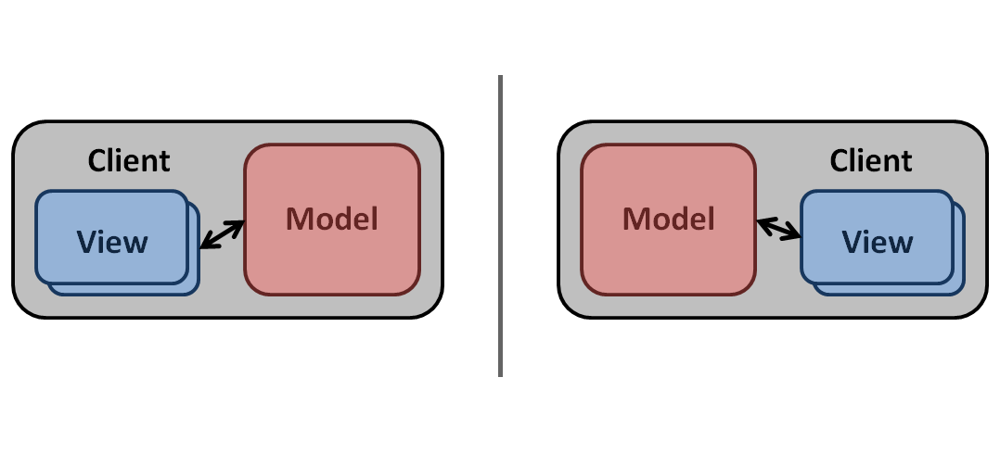
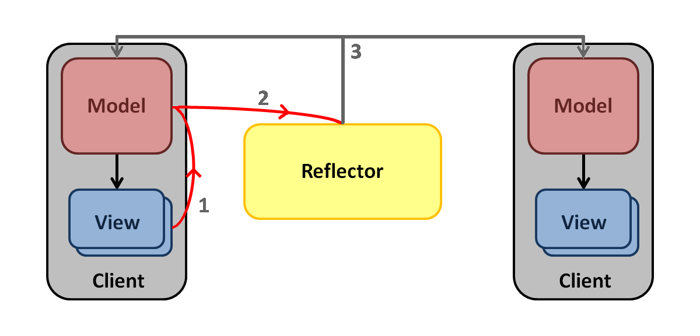

App Developer Installation 
==========================
--------------------------

### Windows 

To install the windows version of Virtual World Framework,Download and run the [Windows Installer](http://download.virtualworldframework.com/files/VWF_Windows_Install.exe) and execute the installation file.

Launch a command prompt window and create a new VWF application folder:

    c:\> vwf create MyApp

Change into your new application folder, and start the Node JS server.

    c:\> cd MyApp
	c:\MyApp> vwf

--------------------------

### Mac OS X / Linux 

NOTE: On Mac OS X, please make sure you have [Xcode Command Line Tools](https://developer.apple.com/xcode/) installed prior to executing the script.

Execute the following command at your terminal/shell prompt:

    /home/user# curl -kL http://get.virtual.wf  | sh
	
Launch a command prompt window and create a new VWF application folder:

    /home/user# vwf create MyApp

Change into your new application folder, and start the Node JS server.

    /home/user# cd MyApp
	/home/user/MyApp# vwf

Core Developer Installation 
==========================
--------------------------

Note: You need only follow these instructions if you plan on developing VWF core functionality (for example, writing or modifying a driver). If instead, you wish to develop VWF Applications on top of the framework, please follow the instructions above.

--------------------------

### Windows 

Please make sure you have the following software packages installed:

Prerequisites:

1. [Ruby 1.9.3](http://dl.bintray.com/oneclick/rubyinstaller/rubyinstaller-1.9.3-p484.exe?direct)
2. [Ruby DevKit 4.5.2](https://github.com/downloads/oneclick/rubyinstaller/DevKit-tdm-32-4.5.2-20111229-1559-sfx.exe)
2a. Download it, run it to extract it somewhere (permanent). Then cd to it, run “ruby dk.rb init” and “ruby dk.rb install” to bind it to ruby installations in your path.
3. [RubyGems](http://rubygems.org/pages/download#formats)
4. [Git Client For Windows](http://git-scm.com/download/win) or [TortoiseGit](https://code.google.com/p/tortoisegit/) 

Once your Ruby and Git environments are set up for Windows, the easiest way to start developing is to:

1. [Fork the VWF repo from the Development Branch](https://github.com/virtual-world-framework/vwf/tree/development)
2. Clone your newly forked VWF repo to your local machine.
3. Run *bundle install* to install your local gems.
3. Make your code modifications.
4. Compile the code using *bundle exec rake windows* from the command prompt in your VWF folder.
5. Start your server using *bundle exec thin start* from the command prompt in your VWF folder to test your changes.
5. Submit a Pull Request after you complete your updates and testing back to the Virtual World Framework Team's VWF repo.

### Ubuntu/Debian Package  

Perform the following shell command at a user shell prompt:

	sudo curl https://raw.github.com/virtual-world-framework/vwf/master/support/build/Scripts/build_debian.sh | bash -x

### Red Hat Enterprise Linux Automatic Installation

Perform the following shell command at a user shell prompt:

	sudo curl https://raw.github.com/virtual-world-framework/vwf/master/support/build/Scripts/build_redhat.sh | bash -x

### Linux / Mac OS X
 
 
### RubyGems

Ensure RubyGems is installed (for Debian/Ubuntu). 

	sudo apt-get update
	sudo apt-get install ruby1.9.1 ruby1.9.1-dev \ rubygems1.9.1 irb1.9.1 ri1.9.1 rdoc1.9.1 \ build-essential libopenssl-ruby1.9.1 libssl-dev zlib1g-dev
	sudo update-alternatives --install /usr/bin/ruby ruby /usr/bin/ruby1.9.1 400 \
         --slave   /usr/share/man/man1/ruby.1.gz ruby.1.gz \
                        /usr/share/man/man1/ruby1.9.1.1.gz \
        --slave   /usr/bin/ri ri /usr/bin/ri1.9.1 \
        --slave   /usr/bin/irb irb /usr/bin/irb1.9.1 \
        --slave   /usr/bin/rdoc rdoc /usr/bin/rdoc1.9.1
	sudo update-alternatives --config ruby
	sudo update-alternatives --config gem	

Now try 

	ruby --version

and you should get the 1.9.# baseline for ruby reported back.	
	
Or (for Red Hat/Fedora)

	yum install ruby rubygems

Or (for OSX with Homebrew)

Make sure you have the [Command Line Tools for XCode](https://developer.apple.com/downloads/index.action) installed.
	
	ruby -e "$(curl -fsSkL raw.github.com/mxcl/homebrew/go)"
	brew install automake

The script explains what it will do and then pauses before it does it
	
	\curl -L https://get.rvm.io | bash -s stable --ruby
	source ~/.rvm/scripts/rvm

This installs RVM which is a version manager for Ruby.
	
	rvm install 1.9.3-head
	rvm use ruby-1.9.3-head
	rvm rubygems current
	This adds Ruby 1.9.3 to your machine and sets 1.9.3 as the default Ruby version.

	brew install git
	This installs git if you do not have it already on your machine.

### Download Virtual World Framework

Download the contents of the GitHub Master VWF Baseline to your local directory:

	sudo git clone http://www.github.com/virtual-world-framework/vwf --recursive

### Install the Gems

Launch a terminal window and cd to your VWF development directory:

	cd vwf/

Then enter these commands:

	sudo gem install rubygems-update
	sudo update_rubygems 
	sudo gem install bundler

Now you can install the RubyGems to the system (as root):

	sudo bundle install

### Build the Server
This command will compile and setup the server baseline.

    sudo bundle exec rake 

### Launch the Server
This command launches Ruby's Thin web server to start serving your VWF applications.

	sudo bundle exec thin start

### Connect

The server runs on port 3000 in development mode by default. Use Google Chrome to view the website.

NodeJS Core Developer Installation
==========================
--------------------------

As an alternative to the ruby version of the VWF server, there also exists a node.js version (which will soon become the primary supported server). To be on the bleeding edge and use the node.js version of the server now:

1. Install Node.js for your specific environment [http://www.nodejs.org](http://www.nodejs.org).

2. You should already have a baseline on your local machine by following the [Core Developer Installation Instructions](http://localhost:3000/web/documentation.html#advancedInstall)

3. Launch a terminal/command prompt window and cd to your VWF application directory.

    cd Path\To\YourApp

4. Run the vwf command to start the Node JS server.

    vwf

Configuring HTTPS/SSL Traffic
==========================
--------------------------

The Virtual World Framework is able to work over an HTTPS/SSL configuration.  Below we outline how to setup a Linux environment running Thin web server with SSL as this is our preferred operational environment for the VWF server; however you may use SSL for any combination of operating system, and we ask that if you do configure and run SSL installations on other platforms that you please generate a Pull Request on GitHub and update this page with instructions on your preferred platform. Thank you in advance!

The following is an extremely simplified view of how SSL is implemented and what part the certificate plays in the entire process.

Normal web traffic is sent unencrypted over the Internet. That is, anyone with access to the right tools can snoop all of that traffic. Obviously, this can lead to problems, especially where security and privacy is necessary, such as in credit card data and bank transactions. The Secure Socket Layer is used to encrypt the data stream between the web server and the web client (the browser).

### Step 1. Generate a Private Key
 
The openssl toolkit is used to generate an RSA Private Key and CSR (Certificate Signing Request). It can also be used to generate self-signed certificates which can be used for testing purposes or internal usage.

The first step is to create your RSA Private Key. This key is a 1024 bit RSA key which is encrypted using Triple-DES and stored in a PEM format so that it is readable as ASCII text.

    openssl genrsa -des3 -out server.key 1024

Generating RSA private key, 1024 bit long modulus 
.........................................................++++++ 
........++++++ 
e is 65537 (0x10001) 
Enter PEM pass phrase: 
Verifying password - Enter PEM pass phrase:  
 
### Step 2: Generate a CSR (Certificate Signing Request)
 
Once the private key is generated a Certificate Signing Request can be generated. The CSR is then used in one of two ways. Ideally, the CSR will be sent to a Certificate Authority, such as Thawte or Verisign who will verify the identity of the requestor and issue a signed certificate. The second option is to self-sign the CSR, which will be demonstrated in the next section.

During the generation of the CSR, you will be prompted for several pieces of information. These are the X.509 attributes of the certificate. One of the prompts will be for "Common Name (e.g., YOUR name)". It is important that this field be filled in with the fully qualified domain name of the server to be protected by SSL. If the website to be protected will be https://public.akadia.com, then enter public.akadia.com at this prompt. The command to generate the CSR is as follows:

    openssl req -new -key server.key -out server.csr

Country Name (2 letter code) \[GB\]:US 
State or Province Name (full name) \[Berkshire\]:Florida 
Locality Name (eg, city) \[Newbury\]:Orlando 
Organization Name (eg, company) \[My Company Ltd\]:Test 
Organizational Unit Name (eg, section) []:Test Technology 
Common Name (eg, your name or your server's hostname) []:public.whatever.com 
Email Address []:test@test.com 
Please enter the following 'extra' attributes 
to be sent with your certificate request 
A challenge password: 
An optional company name:  

### Step 3: Remove Passphrase from Key
 
One unfortunate side-effect of the pass-phrased private key is that Apache will ask for the pass-phrase each time the web server is started. Obviously this is not necessarily convenient as someone will not always be around to type in the pass-phrase, such as after a reboot or crash. mod_ssl includes the ability to use an external program in place of the built-in pass-phrase dialog, however, this is not necessarily the most secure option either. It is possible to remove the Triple-DES encryption from the key, thereby no longer needing to type in a pass-phrase. If the private key is no longer encrypted, it is critical that this file only be readable by the root user! If your system is ever compromised and a third party obtains your unencrypted private key, the corresponding certificate will need to be revoked. With that being said, use the following command to remove the pass-phrase from the key:

    cp server.key server.key.org
    openssl rsa -in server.key.org -out server.key

The newly created server.key file has no more passphrase in it.

-rw-r--r-- 1 root root 745 Jun 29 12:19 server.csr
-rw-r--r-- 1 root root 891 Jun 29 13:22 server.key
-rw-r--r-- 1 root root 963 Jun 29 13:22 server.key.org

### Step 4: Generating a Self-Signed Certificate
 
At this point you will need to generate a self-signed certificate because you either don't plan on having your certificate signed by a CA, or you wish to test your new SSL implementation while the CA is signing your certificate. This temporary certificate will generate an error in the client browser to the effect that the signing certificate authority is unknown and not trusted.

To generate a temporary certificate which is good for 365 days, issue the following command:

    openssl x509 -req -days 365 -in server.csr -signkey server.key -out server.crt

Signature ok 
subject=/C=CH/ST=Test/L=TestName/O=Test Co/OU=Test Technology/CN=public.whatever.com/Email=test@test.com 
Getting Private key 

### Step 5: Installing the Private Key and Certificate
 
Thin is capable of reading SSL within a configuration yml file for startup.  First we move the certificates generated to a permanent location.

    mkdir /etc/thin_ssl
    cp server.crt /etc/thin_ssl/ssl.crt
    cp server.key /etc/thin_ssl/ssl.key

At this point you will want to add three lines to your Thin Server yml file:

    ssl: true
    ssl_cert_file: /etc/thin_ssl/ssl.crt
    ssl_key_file: /etc/thin_ssl/ssl.key

Restart your thin servers at this point and you should now be able to connect to your server using https://  
Please remember that SSL traffic is on port 443, and you will need to have this port open in your firewall.

<a name="tutorials" />

Tutorials
===================
-------------------

To get started, please view the sample step by step guides to building an application within the framework. The [first example](documentation.html#tutorial1) walks through the basic components of an application, and serves as a *Hello World* for the Virtual World Framework.

The [second example](documentation.html#tutorial1) is a basic tutorial that consists of four stages, bringing the developer from the creation of a primitive scene to a simple sandtable application. 

-------------------

<a name="tutorial1" />

Hello World Tutorial 
===============
* * *

Virtual World Framework (VWF) is a collaborative training platform that is scalable, sustainable and can be run via a browser.

* * *

The most basic implementation of VWF is a single asset in a COLLADA format. A URL pointing directly to an asset COLLADA file (.dae) with no code will result in a scene containing the specified asset with default light, camera, and navigation.

Sample URL: *http://vwf.example.com/application/hello.dae*

* * *

An asset can be wrapped in a VWF application by specifying the source file in the code.

Code View: *index.vwf.yaml*

	---
	source: hello.dae

Sample URL: *http://vwf.example.com/application/index.vwf*

* * *

Prototypes for nodes are defined within the framework. Extend these prototypes and specify a file source to create application components. For example, an application child can extend a node type with a COLLADA file.

	--- 
	children:
	  hello:
	    extends: http://vwf.example.com/node3.vwf
	    source: hello.dae
	    type: model/vnd.collada+xml

* * *

An application scene can extend the navscene type and transform properties may be set directly on a child node.

Code View: *index.vwf.yaml*

	--- 
	extends: http://vwf.example.com/navscene.vwf
	children: 
	  hello: 
	    extends: http://vwf.example.com/node3.vwf
	    source: hello.dae
	    type: model/vnd.collada+xml
	    properties: 
	      translation: [ 0, 0, 0 ]

Sample URL: *http://vwf.example.com/web/example/1/*

<!-- <iframe src="../../web/example/1">Example 1</iframe> -->

Activate Application  
<iframe id="ex1_frame" src="about:blank" style="width:100%;"></iframe>

* * *

Nodes inherit data from their prototype, including the following:

*   Source / Type
	*   Specifying a source or type within a derived node replaces the value in the prototype.
*   Properties / Methods / Events
	*   A derived node's definition augments those in the prototype.
	*   Creating one of a new name is a new definition
	*   Using an existing name overrides the prototype's definition
*   Children
	  * A derived node's children augment the prototype
	  * Creating one of a new name is a new definition
	  * Using an existing name configures the definition from the prototype
*   Scripts
	  * A derived node's scripts augment the prototype
	
* * *

Add additional children to the application and set their properties. 

Code View: *index.vwf.yaml*

	--- 
	extends: http://vwf.example.com/navscene.vwf
	children:
	  hello:
	    extends: http://vwf.example.com/node3.vwf
	    source: hello.dae
	    type: model/vnd.collada+xml
	    properties:
	      translation: [ 0, 0, 5 ]
	      rotation: [ 1, 0, 0, 0]
	      scale: 1
	  world:
	    extends: http://vwf.example.com/node3.vwf
	    source: world.dae
	    type: model/vnd.collada+xml
	    properties:
	      translation: [ 0, 0, -5 ]
	      rotation: [ 1, 0, 0, 0]
	      scale: 1

Sample URL: *http://vwf.example.com/web/example/2/*

<!-- <iframe src="../../web/example/2">Example 2</iframe> -->

Activate Application  
<iframe id="ex2_frame" src="about:blank" style="width:100%;"></iframe>

* * *

**Note:** A component specification may be an object literal, a uniform resource identifier (URI) to a .vwf or another type such as .dae, or a JSON-encoded object (primarily for use in the single-user mode application= URI parameter). Components may appear as an extends, implements, or child within the application or another component. 

* * *

Define properties of the application and children with or without accessors.

	--- 
	extends: http://vwf.example.com/navscene.vwf
	children:
	  hello:
	    extends: http://vwf.example.com/node3.vwf
	    source: hello.dae
	    type: model/vnd.collada+xml
	    properties:
	      translation:
	        set: |
	          this.translation = value;
	        value: [ 0, 0, 5 ]

* * *

Specifying set or get as null prevents writing and/or reading, respectively.

	--- 
	extends: http://vwf.example.com/navscene.vwf
	children:
	  hello:
	    extends: http://vwf.example.com/node3.vwf
	    source: hello.dae
	    type: model/vnd.collada+xml
	    properties:
	      translation:
	        set: null
	        get: null
			
* * *	  

Bind child nodes defined in the asset file to the application and modify their properties. Set materials with direct access from the main node to the material node of the asset file, without defining the entire structure in code.

Code View: *index.vwf.yaml*

	---
	extends: http://vwf.example.com/navscene.vwf
	children:
	  hello:
	    extends: http://vwf.example.com/node3.vwf
	    source: hello.dae
	    type: model/vnd.collada+xml
	    properties:
	      translation: [ 0, 0, 5 ]
	    children:
	      material:
	        extends: http://vwf.example.com/material.vwf
	        properties: 
	          color: red
	  world:
	    extends: http://vwf.example.com/node3.vwf
	    source: world.dae
	    type: model/vnd.collada+xml
	    properties:
	      translation: [ 0, 0, -5 ]
	    children:
	      material:
	        extends: http://vwf.example.com/material.vwf
	        properties: 
	          color: blue
		  
URL: *http://vwf.example.com/web/example/3/*

<!-- <iframe src="../../web/example/3">Example 3</iframe> -->

Activate Application  
<iframe id="ex3_frame" src="about:blank" style="width:100%;"></iframe>

* * *

The properties of the default lighting and navigation can be specified within the application file.

	---
	children:
	  maincamera:
	    extends: http://vwf.example.com/camera.vwf
	    properties:
	      rotation: [ 1, 0, 0, 90 ]

* * *

Assemble applications from content on multiple servers.

	--- 
	children:
	  hello:
	    extends: http://vwf.example.com/node3.vwf
	    source: hello.dae
	    type: model/vnd.collada+xml
	  world:
	    extends: http://vwf.example.com/node3.vwf
	    source: http://anotherserver.com/world.dae
	    type: model/vnd.collada+xml

* * *

Specify methods related to children of application.

	--- 
	children:
	  hello:
	    extends: http://vwf.example.com/node3.vwf
	    source: hello.dae
	    type: model/vnd.collada+xml
	    properties:
	      rotation: [ 1, 0, 0, 0]
	    methods:
	      click: this.rotation.z += 5

* * *

Move the child of the application or asset to a component, placing related code in a separate .yaml file. Reuse the created component on other assets.

Code View: *rotate.vwf.yaml*

	---
	methods:
	  click: this.rotation.z += 5
    
Code View: *index.vwf.yaml*

	---
	children:
	  hello:
	    extends: rotate.vwf
	    source: hello.dae
	  world:
	    extends: rotate.vwf
	    source: world.dae

URL: *http://vwf.example.com/application/index.vwf*

* * *

Add JavaScript functions to application components by defining scripts as a child of the application or a specific component. Prototypes define some functions that can be extended, such as pointerClick.

Code View: *index.vwf.yaml*

	---
	extends: http://vwf.example.com/navscene.vwf
	children:
	  hello:
	    extends: http://vwf.example.com/node3.vwf
	    source: hello.dae
	    type: model/vnd.collada+xml
	    properties:
	      translation: [ 0, 0, 5 ]
	    children:
	      material:
	        extends: http://vwf.example.com/material.vwf
	        properties: 
	          color: red
	    scripts:
	    - |
	        this.pointerClick = function() {
	          if ( this.material.color == "rgb(255,0,0)" ) {
	            this.material.color = "blue";
	          } else {
	            this.material.color = "red";
	          }
	        }
	  world: 
	    extends: http://vwf.example.com/node3.vwf
	    source: world.dae
	    type: model/vnd.collada+xml
	    properties: 
	      translation: [ 0, 0, -5 ]
	    children:
	      material:
	        extends: http://vwf.example.com/material.vwf
	        properties: 
	          color: blue
	    scripts:
	    - |
	        this.pointerClick = function() {
	          if ( this.material.color == "rgb(255,0,0)" ) {
	            this.material.color = "blue";
	          } else {
	            this.material.color = "red";
	          }
	        }

URL: *http://vwf.example.com/web/example/4/*

In this example, clicking on an object will run the pointerClick function, changing the color of the object's material. 

<!-- <iframe src="../../web/example/4">Example 4</iframe> -->

Activate Application  
<iframe id="ex4_frame" src="about:blank" style="width:100%;"></iframe>

* * *

Define additional HTML and jQuery components in an index.vwf.html file. The application will look for a file of this name on load, and will load any scripts or two dimensional components identified. This HTML file interaction can bind user interface components to children and properties defined in the application file. The following example shows the JavaScript defined in the HTML file interacting with the property defined in the YAML file.

Code View: *index.vwf.yaml*

	--- 
	extends: http://vwf.example.com/node.vwf
	children: 
	  game:
	    extends: http://vwf.example.com/node.vwf
	    properties:
	      position01: [ 0, 0 ]

Code View: *index.vwf.html*

	<!DOCTYPE html>
	<html>
	  <head>
	    
	  </head>
	  <body>
	    

	      

	        
	          
	        
	      

	    

	  </body>
	</html>

URL: *http://vwf.example.com/application/index.vwf*

* * *

By default, the framework will search for the index.vwf.yaml file. Thus, if the application is defined in that file, the application can be reached with the following URL: http://*IP:port*/*applicationname*/ and index.vwf will automatically be initiated. If the application is defined in another file, the application can be reached with the following URL: http://*servername*/*applicationname*/*applicationname*.vwf.

* * *

The Virtual World Framework can be used in either single user or multi-user mode. An independent session of the application can be initialized by a URL without a session ID: *http://vwf.example.com/application/*. The URL from the initial user can be used to allow additional users to join the session, specified by the session ID. Example: *http://vwf.example.com/application/561f86e42b6763d0/*. This session ID will be pulled out of the URL, and replaced with a session variable that will still be accessible via the URL. The session can run for a given time, and as a new user joins, the content will be synched to the current state of the application.

-------------------
<a name="tutorial2" />

Sandtable Tutorial
===================
-------------------

<iframe width="560" height="315" src="http://www.youtube.com/embed/mMhgA9fwdWs" frameborder="0" allowfullscreen></iframe>

 
The goal of the following tutorial is to allow a developer to build an application from a simple primitive to small sandtable application. The tutorial is broken up into four stages, each building upon itself to create a more complex application.

*   Stage 1 - Primitive Scene
*   Stage 2 - Terrain Model and Orbit Navigation
*   Stage 3 - Multiple Models and Behaviors
*   Stage 4 - HTML Overlays and Interaction

_____________________________________________________________________________________

Stage 1 - Primitive Scene
--------
In the first stage, we'll add in a basic primitive collada file, and set up the initial camera position. The application will contain the default navigation of a fly mode.

The following code creates a child node of the application named blueCube, of type node3, and defines the source file. In the scripts section, the camera transform is initialized, and will be set during the application load. 

	---
	extends: http://vwf.example.com/scene.vwf
	children:
	  blueCube:
	    extends: http://vwf.example.com/node3.vwf
	    source: models/BlueCube.dae
	    type: model/vnd.collada+xml
	methods:
	  initializeCamera:
	scripts:
	- |
	  this.initialize = function() {
	    this.future( 0 ).initializeCamera();
	  }

	  this.initializeCamera = function() {
	    this.camera.translation = [ 0, -100, 0 ];
	  }

The above is all that is needed to create an application. The default fly mode allows the user to navigate with the standard WASD keys, as well as Q and E to rotate. 

Example: [Primitive Scene](../../tutorial/00)

_____________________________________________________________________________________

Stage 2 - Terrain Model and Orbit Navigation
--------
In the second stage, we will:

*   Set the background color scene property to an RGB value to give the appearance of sky
*   Use the navscene component and navmode scene property to change the navigation mode to orbit around a single point
*   Replace the blue cube with a terrain model
*   Set the terrain's position, rotation, and scale
*   Add a "sceneCenter" child to the application (setting its translation property)
*   Tell the camera to always look at sceneCenter by setting the camera's "lookat" property to the id of sceneCenter
*   Set other camera properties in the initializeCamera function, including "far" and "near", setting up clipping planes for this much larger terrain model. 

The code to do so is as follows:

	---
	extends: http://vwf.example.com/navscene.vwf
	properties:
	  backgroundColor: [ 83, 157, 194 ]
	  navmode: "orbit"
	methods:
	  initializeCamera:
	children:
	  flat_terrain:
	    extends: http://vwf.example.com/node3.vwf
	    source: models/vwf_terrain.dae
	    type: model/vnd.collada+xml
	    properties:
	      translation: [ 0, 0, -1000 ]
	      scale: [ 0.008, 0.008, 0.020 ]
	  sceneCenter:
	    extends: http://vwf.example.com/node3.vwf
	    properties:
	      translation: [ 0, 0, 0 ]
	scripts:
	- |
	  this.initialize = function() {
	    this.future( 0 ).initializeCamera();
	  }

	  this.initializeCamera = function() {
	    this.camera.translation = [ 0, 20000, 10000 ];
	    this.camera.far = 500000;
	    this.camera.near = 2;
	    this.camera.lookAt = this.sceneCenter.id;
	  }

In this application, the WASD controls can be used for navigation; however, the camera will continue to focus on the sceneCenter point.

Example: [Terrain Model and Orbit Navigation](../../tutorial/01)

_____________________________________________________________________________________

Stage 3 - Multiple Models and Behaviors
--------
In the third stage, we'll add an additional child node for a predator vehicle called 'predator' with similar property definitions. We'll then apply a behavior to the 'predator' node, which is defined in a separate yaml file. Setting the property 'fly-flying' to true will enable the flying behavior immediately upon application load. 

	---
	extends: http://vwf.example.com/navscene.vwf
	properties:
	  backgroundColor: [ 83, 157, 194 ]
	  navmode: "orbit"
	children:
	  flat_terrain:
	    extends: http://vwf.example.com/node3.vwf
	    source: models/vwf_terrain.dae
	    type: model/vnd.collada+xml
	    properties:
	      translation: [ 0, 0, -1000 ]
	      scale: [ 0.008, 0.008, 0.020 ]
	  sceneCenter:
	    extends: http://vwf.example.com/node3.vwf
	    properties:
	      translation: [ 0, 0, 0 ]
	  predator:
		extends: http://vwf.example.com/node3.vwf
		implements:
		- http://vwf.example.com/fly.vwf
		source: models/Predator.dae
		type: model/vnd.collada+xml
		properties:
		  translation: [ 0, 500, 1800 ]
		  rotation: [ 0, 0, 1, 180 ]
		  scale: 50
		  fly-flying: true
	scripts:
	- |
	  this.initialize = function() {
	    this.future( 0 ).initializeCamera();
	  }
	  
	  this.initializeCamera = function() {
	    this.camera.translation = [ 0, 20000, 10000 ];
	    this.camera.far = 500000;
	    this.camera.near = 2;
	    this.camera.lookAt = this.sceneCenter.id;
	  }

Example: [Multiple Models and Behaviors](../../tutorial/02)

_____________________________________________________________________________________

Stage 4 - HTML Overlays and Interaction
--------
In the fourth stage, we'll add an HTML overlay to the application, and setup the javascript to allow the 2D HTML components interact with the 3D nodes. For this application, we'll create a toolbar of two images, one to select navigation mode, and one to select pindrop mode, where navigation will be disabled, and a click of the mouse will mark the location selected. 

First, we'll create a file called 'index.vwf.html' that will load separately or on top of the application. The name must match that of the 'index.vwf.yaml' file, and the framework will automatically look for that file. We'll define the body with a simple HTML toolbar div containing the two button images. This will allow us to select either navigation mode, or pindrop mode. 

In the yaml file, we'll add a mouseMode property with a setter. This property will determine whether the navmode is set to 'orbit' or turned off. We'll then add javascript variables and additional functions to drop the pins. The pushpin variable describes the child node that will be added, and will look similar to a child definition. The pointerUp function checks the navigation mode and will call the pindrop function if necessary to create the new node. 

	---
	extends: http://vwf.example.com/navscene.vwf
	properties:
	  backgroundColor: [ 83, 157, 194 ]
	  navmode: "orbit"
	  mouseMode:
	    set: |
	      if( value == "orbit" ) {
	        this.navmode = "orbit";
	      } else {
	        this.navmode = "none";
	      }
	    value: "orbit"
	children:
	  flat_terrain:
	    extends: http://vwf.example.com/node3.vwf
	    source: models/vwf_terrain.dae
	    type: model/vnd.collada+xml
	    properties:
	      translation: [ 0, 0, -1000 ]
	      scale: [ 0.008, 0.008, 0.020 ]
	  sceneCenter:
	    extends: http://vwf.example.com/node3.vwf
	    properties:
	      translation: [ 0, 0, 0 ]
	  predator:
		extends: http://vwf.example.com/node3.vwf
		implements:
		- http://vwf.example.com/fly.vwf
		source: models/Predator.dae
		type: model/vnd.collada+xml
		properties:
		  translation: [ 0, 500, 1800 ]
		  rotation: [ 0, 0, 1, 180 ]
		  scale: 50
		  fly-flying: true
	scripts:
	- |
	  this.initialize = function() {
	    this.future( 0 ).initializeCamera();
	  }
	  
	  this.initializeCamera = function() {
	    this.camera.translation = [ 0, 20000, 10000 ];
	    this.camera.far = 500000;
	    this.camera.near = 2;
	    this.camera.lookAt = this.sceneCenter.id;
	  }

	  var pushpinIndex = 1;
	  var pushpin = {
	    extends: "http://vwf.example.com/node3.vwf",
	    source: "models/pushpinblack.dae",
	    type: "model/vnd.collada+xml",
	    properties: {
	      scale: 6
	    },
	  };

	  this.pointerUp = function( parms, pickInfo ){
	    if( this.mouseMode == "pindrop") {
	        this.pindrop( pickInfo );
	    }
	  }
	  
	  this.pindrop = function( pickInfo ) {
	    if ( pickInfo && pickInfo.globalPosition ) {
	      pushpin.properties.translation = pickInfo.globalPosition;

	      var name = "pushpin"+pushpinIndex;
	      this.children.create( name, pushpin );
	      pushpinIndex++;
	    }
	  }

Finally, back in the HTML file, we'll need to add a few javascript functions to highlight the appropriate button selected, as well as to set the global application property, mouseMode. The final thing to add is a listener for the mouseMode property. This will come into play if the mode is changed on another client, and the button highlighted is appropriately changed. 

	function setMode(mode) {
    	highlightMode(mode);
        vwf_view.kernel.setProperty(vwf.find("", "/")[0], "mouseMode", mode);
  	}

    function highlightMode(mode) {
       	document.getElementById('orbit').style.border = "2px solid black";
       	document.getElementById('pindrop').style.border = "2px solid black";

       	document.getElementById(mode).style.border = "3px solid red";
    }

    vwf_view.satProperty = function (nodeId, propertyName, propertyValue) {
      	if (nodeId == vwf.find("", "/")[0] ) {
      		switch (propertyName) {
      		  case "mouseMode":
      		    highlightMode( propertyValue );
      		    break;
            }
        }
    }	  

Example: [HTML Overlays and Interaction](../../tutorial/03)

-------------------
<a name="devguide" />

Dev Guide
===================
-------------------

The developers guide is an overview of the different components and concepts used with the framework. Try the links to the left to view the current guide. 

-------------------<a name="architecture" />

Architecture
===================
-------------------

The architecture behind the Virtual World Framework is by design:

* Fully web-based
* Component-based
* Multi-user collaborative

The VWF architecture allows an application developer to focus on creating content in the mindset of a single-user application. If development is performed using the standard framework conventions, nothing else must be done to achieve a synchronized state across multiple users in the environment. 

-------------------

**Collaborative Nature**

The Virtual World Framework is a model - view based architecture. Views exist for each client joined in the application. Each view provides input into a model that keeps track of the state of the simulation. 

The single model, or shared state, of the application has multiple copies that represent the shared simulation. 

Each client then has their own replicated model that they take with them. The model, however, remains the same as the one that every other user is viewing. All clients show the same state with each having an indentical copy of the application. The applications are separately but simultaneously updated to retain identical states. 

The application then is a state machine. The same state machine is in different locations (different clients). If the state machines all have the same properties and children, they will all move to the same successive state.

A client's browser may have multiple views. For example, a user may see and renderer view and an editor view in their browser window. The renderer view shows a 3D visualization of the model state, and the editor view shows the hierachy of the scene and the pieces that make it up such as it's properties and children.

External inputs from one user get thrown "across the moat" into the shared simulation (model) \[1\]. The model deflects incoming input from a view, and sends it directly to the reflector \[2\]. The reflector can then send out the information to all of the replicated models \[3\]. Thus all inputs to a model happen identically on the timeline to all clients within the application. 

The architecture separates external input from internal input. All external input (ie. user input from a view), once received by the model is deferred to the reflector, which then sends it out to everyone. However, the model is free to make any additional state changes (ie. internal input) provided that it was caused by something internal to the model. This would include things such as setter methods that can manipulate other internal properties. 

-------------------

**Parts of VWF**

VWF consists of two pieces:

1. Core: Consists of the server and part of the client and ensures synchronization between the model state on every client.
2. Drivers: Add functionality to VWF by providing access to 3rd party libraries (like three.js for graphics)

VWF enables one to create:

1. Components: A meaningful unit of functionality. Components are the building blocks of VWF applications.  A component might contain a 3D model and/or it might contain some functionality.
2. Applications: This is a full VWF ... well ... application.  It's something that a user can sit down and use.

The VWF ecosystem is everything that exists to help developers create components and applications.  Many of the items listed in the *Ecosystem* circle are works in progress.

-------------------

**Component Structure**

A VWF application is made up of components. Each component in the system is built up from smaller components (i.e. children) or through inheritance (i.e. prototypes) within the user's programming space. 

The application is essentially a component itself, and can have one or more child components. Each child component can then have one or more children, creating a tree structure.

Additionally, components may extend prototype components, and will inherit their properties, methods, and events. A prototype may have multiple components that extend it in an application.

The [components](#components) section provides further detail about creating application components, and the [prototypes](#prototypes) page describes the VWF base types. 

-------------------

**The Drivers**

We've discussed how to write an application using the framework. The next section describes how the system works, and how to reconfigure the system to accomplish more complex tasks. The drivers of the system are the things that connect components to the 3D visualization and the user interaction that you see. 

The drivers define the autonomic actions that happen within a system, dividing responsibility and delegating work for each action of the system. These actions include things such as creating or deleting a node, getting or setting a property, calling methods, and firing events. The drivers stand side by side without direct interaction between them. Rather, they interact by autonomic actions that the kernel manages. 

For example, the GLGE driver is responsible for any manipulation on the node that's part of the scene, like setting the translation of a node. This information may be ignored by the rest of the drivers if it is not needed. 

Model and view drivers have the same structure; however, the model driver doesn't reach out, and a view driver does not have direct control. 

For more detailed information regarding the drivers, please reference the [drivers](#drivers) page.

--------------------

<a name="components" />

Components
===================
-------------------

Components define the behavior, state and visual representation of an object, and are the basic building blocks of VWF. Components make up a hierarchical structure, with each component acting as the parent or child to another component. At the root of the structure is the application, which is also a component, and is created automatically when the application loads.

-------------------

Component Contents
-------------------
-------------------

There are eight parts that make up a component, seen here as a skeleton in YAML.

	---
	extends:
	implements:
	source:
	type:
	properties:
	methods:
	events:
	children:
	scripts:

Each part is optional and only needs to be include in the component definition if that part needs to be customized in the component. All relative paths are resolved using the current component as the base.

**extends**

This specifies the URI or descriptor of the prototype component that is extended to make the new component. All behaviors, properties, methods, events, children and scripts are inherited by the component. The default prototype is <code>http://vwf.example.com/node.vwf</code>.

To specify a prototype using a URI, simply provide the URI.

	extends: http://vwf.example.com/path/to/prototype.vwf

Since a prototype is also a component, it can be specified using the same format.

	extends:
	  extends:
	  implements:
	  source:
	  type:
	  properties:
	  methods:
	  events:
	  children:
	  scripts:

See [prototypes](prototypes.html) for more information.

**implements**

This specifies the URIs of components that will be used as behaviors. All behaviors, properties, methods, events, children and scripts are inherited by the component, allowing functionality to be added from a separate file.

	implements:
	- http://vwf.example.com/path/to/behavior.vwf

See [behaviors](behaviors.html) for more information.

**source/type**

The source and type allow the component to load a seperate data blob, usually in the form of a 3D model or image. Source is the URI of the data, and type is the MIME type. If type is not specified, it will default to the MIME type taken from the server's response.

	source: model.dae
	type: model/vnd.collada+xml

**properties**

Properties are the public variables of the component. The component inherits properties from its prototype and any behaviors. Initializing a property will override any default values from the prototype or behavior.

The declaration for a property provides only a name, and an optional value.

	properties:
	  aProperty: value

Properties can also be declared with accessor functions that allow the component to detect changes, allow only acceptable values, or serve as a proxy for another property. 

	properties:
	  aProperty:
	    set: | # calculate and set the value
	      this.aProperty = value
	    get: | # calculate and return the value
	      return this.aProperty
	    value: # the value is available to the accessor functions
	      value

**methods**

Methods are the public functions of the component. The component inherits methods from its prototype and behaviors. Redefining those methods here will override the inherited ones.

The method declaration only provides the body of the method.

	methods:
	  aMethod: |
	  	// method body

The extended method specifier allows named parameters. Additional parameters can still be parsed out of the arguments object when needed.

	methods:
	  anotherMethod:
	    parameters:
	    - one
	    - two
	    body: |
	      var three = arguments[2];
	      this.something(one, two, three);

Methods can also be declared empty, and intialized in a script later.

	methods:
	  aMethod:
	scripts:
	- |
	  this.aMethod = function(one, two, three) {

	  }

**events**

Events define the outgoing messages a node can trigger. The component inherits events from its prototype and behaviors. 

The event specifier only provides the name of the event.

	events:
	  anEvent:

The extended event specifier describes the arguments passed to the event. As with methods, additional parameters can still be parsed out of the arguments object in the event handler.

	events:
	  anotherEvent:
	    parameters:
	    - one
	    - two

To listen for events, a javascript function that matches the event name is added to the Scripts section of the component.

    events:
	  anEvent:
	scripts:
	- |
	  this.anEvent = function() {

	  }

VWF also defines several dispatched events. These are triggered when outside actions, such as a key press or mouse click occur. When one of these events occurs, the system automatically finds any nodes that have been definined as triggering the event, and dispatches the event from those nodes. Currently, the dispatched events defined by VWF are:

* keyDown
* keyUp
* pointerClick
* pointerDown
* pointerOver
* pointerHover
* pointerOut
* pointerMove
* pointerUp
* pointerWheel

**children**

Children are instances of other components that are attached to this component. A child can be a simple reference to a seperate component, or the reference can include a configuration. The format for a child specification is the same as for a component.

	children:
	  childFromURI: http://vwf.example.com/path/to/component.vwf
	  childFromDescriptor:
	    extends: http://vwf.example.com/path/to/component.vwf
	    properties:
          something: value
      childFromDescriptorDetailed:
        extends: http://vwf.example.com/path/to/prototype.vwf
        implements:
        - http://vwf.example.com/path/to/behavior.vwf
        - http://vwf.example.com/a/different/behavior.vwf
        source:
          asset.dat
        type:
          mime/type
        properties:
          name:
            descriptor
          another:
            descriptor
        methods:
          name:
            descriptor
          another:
            descriptor
        events:
          name:
            descriptor
          another:
            descriptor
        children:
        - name:
            component
        - another:
            component
        scripts:
        - specifier
        - specifier

**scripts**

Scripts define the component's internal behavior and can be used to create and use private variables and methods, and event handlers. Currently the only language supported for scripts is JavaScript.

	scripts:
	- |
	  var aVariable;
	  this.aFunction = function() {
	  	...
	  }

Inside a script <code>this</code> always refers to the component that owns the script. Other components can be accessed by navigating up or down the component hierarchy using <code>this.parent</code> and <code>this.children.childName</code>. VWF also defines an <code>intialize</code> function that is automatically executed when a component is intialized. In order to use this function, define it like any other function.

	scripts:
	- |
	  this.initialize = function() {
	  	...
	  }

-------------------

Manipulating Components With JavaScript
-------------------
-------------------

The various parts of a component can also be modified from JavaScript after the component has been initialized as a node. VWF defines several functions to make these changes.

**properties**

New properties can be added using the following syntax.

	this.properties.create("propertyName", value);

The first parameter is the name of the new property, and the second is the value the property will be initialized with. There are also two optional parameters that customize the getter and setter of the parameter. These are passed in as strings.
	
	this.properties.create("propertyName", value, "return this.propertyName;", "this.propertyName = value;");

**methods**

New methods can be added using the following syntax.

	this.methods.create("methodName", [methodParameters,...], methodBody);

The first parameter is the name of the new method, the second is an array of any parameters the method will take, and the third is the body of the method, as a string.

**events**

Creating a new event uses the following syntax.

	this.events.create("eventName", [eventParameters]);

The first parameter is the name of the new event and the second is an array of any parameters the event will take.

New event listeners can also be added.

	this.events.eventName = this.events.add(function() { ... }, phases, this.children.listeningNode);

The first parameter is the function that will be executed when the event occurs. The second parameter is optional and defaults to "bubble". Setting phases to "capture" will prevent the event from propagating to other nodes. The final parameter is the node that is listening for the event. 

**children**

A component can be written as a JavaScript object in the following format.

	var component = {
	  extends: "http://vwf.example.com/path/to/prototype.vwf",
	  implements: ["http://vwf.example.com/path/to/behavior.vwf"],
	  properties: {
	    aProperty: value
	  },
	  methods: {
	    aMethod: function( parameter, ... ) { ... },
        anotherMethod: function( parameter, ... ) { ... }
	  },
	  events: {
	    anEvent: function() { ... },
        anotherEvent: function() { ... }
	  },
	  children: {
	    childFromURI: "http://vwf.example.com/path/to/component.vwf",
        childFromDescriptor: {
	      extends: "http://vwf.example.com/path/to/component.vwf",
	      properties: {
              something: "value"
          }
        }
	  },
	  scripts: [  "this.aFunction = function() { ... }"]
	};

From inside an existing node, the new component can be created using the following syntax.

	this.children.create("componentName", component);

The first argument is the name the new component will be created with, and the second is the JavaScript object for the component itself. The new component will be created as a child of <code>this</code>, and will be treated the same as any other children that were already present.

Children can also be deleted. The delete function takes the JavaScript object of the child that will be deleted.

	this.children.delete(this.children.component);

-------------------

<a name="cameras" />

Cameras
===================
-------------------

The camera capability provides the users viewpoint into the application. Every application automatically creates a camera as part of the scene. This camera can be accessed in javascript through the <code>camera</code> property of the scene node, or through the editor. 

-------------------

Creating New Cameras
-------------------
-------------------

New cameras can be created by creating a node that extends <code>http://vwf.example.com/camera.vwf</code>. 

	var newCamera = {
	  extends: "http://vwf.example.com/camera.vwf"
	};
	this.children.create("newCamera", newCamera);

See [components](components.html) for more information about creating new nodes.

-------------------

Camera Type
-------------------
-------------------

The <code>cameraType</code> property controls whether the camera is a *persepective* or *orthographic* camera. With a perspective camera, the further away an object is, the smaller it will appear. Orthographic cameras always display objects as their actual size. <code>cameraType</code> defaults to "perspective" and can be set using the following syntax.

	this.children['newCamera'].cameraType = "orthographic";

-------------------

Transform Properties
-------------------
-------------------

The camera component extends from node3, and inherits the transform properties, such as translation and rotation. 

The <code>translation</code> property controls the position of the camera. Changing the property will move the camera to the new coordinates, and the view will automatically update with it. <code>translation</code> defaults to \[ 0, 0, 0 \] and can be set using the following syntax. The coordinate system defaults to +x to the right, +y forward, and +z up, if no rotation has been applied.

	this.children['newCamera'].translation = [ 100, -20, 30 ]; // Moves the camera to 100 on the x-axis, -20 on the y-axis, and 30 on the z-axis

The <code>rotation</code> property controls the direction the camera is pointing, as an offset from the default orientation. Changing the property will rotate the camera and automatically update the view. The value takes the from of \[ x, y, z, angle \] where the amount rotation around an axis is axis * angle. 

	this.children['newCamera].rotation = [ 1, 2, 0.5, 90 ]; // From looking down the positive y-axis, rotate 90 degrees around the x-axis, rotation 180 degrees around the y-axis and 45 degrees around the z-axis.

Also, note that the x, y and z values in the rotation array are automatically normalized to a unit vector. So after the above example, reading the value of <code>rotation</code> would return \[ 0.4364357888698578, 0.8728715777397156, 0.21821792423725128, 90 \].

-------------------

Clipping Plane
-------------------
-------------------

The <code>near</code> and <code>far</code> properties are used to control the clipping plane. <code>far</code> controls how far away from the camera another node can get before it is no longer displayed and <code>near</code> property controls how close to the camera another node can get before it is no longer displayed. The values of <code>near</code> and <code>far</code> are restricted so that 0 < near < far. They can be set with the following syntax.

	this.children['newCamera'].far = 10000;
	this.children['newCamera'].near = 1.0;

<code>near</code> and <code>far</code> also control the view buffer. The ratio of far / near should roughly match the size of the world, in order to have accurate depth calculations and avoid overlapping models.

-------------------

Lookat
-------------------
-------------------

The <code>lookAt</code> property affects how the camera moves. If it is set to the id of another node, that node will always be at the center of the cameras view. If the position of the camera changes, the camera will automatically stay pointed at the other node. <code>lookAt</code> can only be set to a valid id, and defaults to "". It can be set using the following syntax.

	this.children['newCamera'].lookAt = this.children['interestingNode'].id;

-------------------

Using Multiple Cameras
-------------------
-------------------

The application uses the <code>activeCamera</code> property of the scene to determine which camera to use as the main viewpoint. Other cameras can be created, but they will not affect what is displayed in the browser unless they have been set as the active camera. Cameras in the model are shared by all clients, and <code>activeCamera</code> will be seen by all clients, unless they switch to a different one in their private view. Setting <code>activeCamera</code> to the id of a camera will automatically switch the view that is displayed in the browser to the view of that camera.

	// this is the scene
	this.activeCamera = this.children['newCamera'].id;

-------------------<a name="lights" />

Lights
==========================
--------------------------
 
The VWF Lights capability provides control of lighting within a VWF application. By default, VWF provides default lighting. In addition, there are three basic light types that can be created within the framework. Each light has properties associated with it that can be manipulated, including attenuation, effects, and shadows. A complete list of light properties can be found under [light](jsdoc_cmp/symbols/light.vwf.html) in the [Application API](application.html).

---

Light Types
--------------------------

**Point**

A point light is represented by a point source in 3D space, and emits light in all directions. The closer an object is to the light source, the more illuminated it becomes.

~~~
 Omni01:
    extends: http://vwf.example.com/light.vwf
    properties:
      lightType: "point"
      translation: [ -150, 150, 150 ]
~~~~	  

**Directional**

Directional lights equally illuminate all objects from a given direction. An application should only have a small number of directional lights if needed, as computations for directional lights need to be done on all pixels on the screen. 

~~~
  dir1:
    extends: http://vwf.example.com/light.vwf
    properties:
      lightType: "directional"
      rotation: [ 1, 0, 0, -10 ]
~~~~	  

**Spot**

Spot lights emit light in a cone shape instead of a sphere. Other than that, spot lights and point lights share the similar properties. Spot lights also have the additional properties of spotCosCutOff and spotExponent, as described in the light API.

~~~
 Spot01:
    extends: http://vwf.example.com/light.vwf
    properties:
      lightType: "spot"
      spotCosCutOff: 0.95
      spotExponent: 10
      translation: [ -150, 150, 150 ]
~~~~	  

---

Light Attenuation
--------------------------

Light attenuation is the decrease in intensity of the light with respect to distance, and applies to both point and spot lights. There are three types of light attenuation: constant, linear, and quadratic. Values for each attenuation type fall between 0 and 1. Attenuation types may be blended to sum of 1. The default values for these are:

* glge-constantAttenuation  = 1
* glge-linearAttenuation    = 0
* glge-quadraticAttenuation = 0
   
**glge-constantAttenuation**
 
Constant attenuation of 1 will result in a light where the intensity is unaffected by distance, and will remain constant until it hits a surface.
  
**glge-linearAttenuation**
  
Linear attenutation will result in a light thats intensity is inversely proportial to the distance from the light source. In other words, the light intensity will diminish at a fixed rate as it travels from the source. 
  
**glge-quadraticAttenuation**

Quadratic attenuation is the most dramatic, where the drop off is exponential to the distance an object is from the light source.

---

Lighting Effects  
--------------------------

**Specular Reflection**

Specular reflection is the reflection of light from a surface where the ray is reflected in a single direction. 

**Diffuse Reflection**
   
Diffuse reflection is the reflection of light from a surface where the ray is reflected at many angles.

--------------------------
<a name="prototypes" />

Prototypes
===================
-------------------

Prototypes are the base component types for inheritance in the Virtual World Framework. A prototype has the same structure as a VWF [component](components.html), and contains common properties, methods, and events. 

A component can inherit from a prototype by using the <code>extends</code> keyword and specifying the URI of the prototype component. All behaviors, properties, methods, events, children and scripts are inherited by the component. 

	extends: http://vwf.example.com/path/to/prototype.vwf

The default values for properties are defined in the prototype file. These properties can be overridden in the component definition file, or left alone to keep the default value. The same is true for methods and events, which can be extended in the component definition. 

The default prototype for all components is <code>http://vwf.example.com/node.vwf</code>.

Prototypes can be housed on any server, and any URI passed to the extends keyword. Common VWF prototypes use a URI of *vwf.example.com*.

**Common Prototypes**

* *node2.vwf* - base type for 2D components
* *node3.vwf* - base type for 3D components
* *camera.vwf* - base type for cameras
* *light.vwf* - base type for lights
* *material.vwf* - base type for materials
* *navscene.vwf* - base type for a navigational scene

The [Application API](application.html) covers the complete list of VWF prototypes and their property, method, and event definitions.

-------------------
<a name="behaviors" />

Behaviors
===================
-------------------

A behavior is a component that is used to add functionality to another component. It is referenced from a seperate file, allowing multiple components to reuse the same behavior. To use a behavior, add an <code>implements</code> section to the component with the URI to the behavior.

	implements:
	- http://vwf.example.com/path/to/behavior.vwf

When a behavior is loaded, all behaviors, properties, methods, events, children and scripts are inherited by the new component. All the inherited functionality can be used as part of the component. Behaviors can also use properties from the component that implement the behavior. For example, in this behavior, <code>someMethod</code> will perform an action based on the value of <code>behavior-someProperty</code>, which defaults to true. The convention for properties from the behavior is to prefix the property name with the name of the behavior, to avoid accidently overriding the value with a property from the implementing component.

	---
	properties:
	  behavior-someProperty: true 
	methods:
	  someMethod: |
	    if(this.behavior-someProperty && this.anotherProperty) {
	      // Do something
	    }
	    else {
	      // Do something else
	    }

<code>anotherProperty</code> is definied in the implementing component, but is still usable in the behavior. If the component that is implementing the behavior needs <code>behavior-someProperty</code> to be false, it simply overrides the value in its own properties. 

	---
	implements:
	- http://vwf.example.com/path/to/behavior.vwf
	properties:
	  behavior-someProperty: false
	  anotherProperty: true
	scripts:
	- |
	  this.doSomething = function() {
	    this.someMethod();
	  }

When <code>someMethod</code> executes, it will read the overridden value of <code>behavior-someProperty</code>, and go into the else statement.

-------------------

<a name="animations" />

Animations
===================
-------------------

**Animation Behavior**

The primary way to accomplish animations in VWF is the animation behavior. All components that extend node3 automatically implement the animation behavior, which provides standardized methods and properties for creating and executing an animation. 

In order to create an animation on a node, the <code>animationUpdate</code> method needs to be implemented. This method is called each time the animation time changes, and is used to update the node to the correct state for that time.

	scripts:
	- |
	  this.animationUpdate = function(time, duration) {
	    // Animate the node. For example, update the translation based on the time
	    this.translateBy([0, 0, 1 * time], 0);
	  }

The animation can then be started by calling the <code>animationPlay</code> method and stopped by calling <code>animationStop</code>.

Common properties used to customize the animation include:

* animationDuration - The length of the animation
* animationRate - The animation playback rate
* animationLoop - Whether or not the animation should replay after reaching the end

A full list of methods and properties can be found under [animation](jsdoc_cmp/symbols/animation.vwf.html) in the [Application API](application.html).

-------------------

**Collada Animations**

Animations defined in the collada document will also be loaded and available to the framework. They are controlled the same way as animations created in a component, except there is no need to implement an <code>animationUpdate</code> method, since the animation information is pulled from the collada file.

Common properties used to customize collada animations include:

* animationStartTime - The time the animation should start at. Used to play a subsection of the animation.
* animationStopTime - The time the animation should stop at. Used to play a subsection of the animation.
* animationStartFrame - Equivalent to animationStartTime, but in frames, instead of seconds.
* animationStopFrame - Equivalent to animationStopTime, but in frames, instead of seconds.
* fps - The frames per second the animation should play at.

-------------------

**Future Call**

Animations can also be created using the future call. The VWF future call can be used to run a method at a specified time in the future. This call can be inserted into the method call chain, and a parameter passed with an amount of time from the current point for when the method should be called. An example of the future call is shown below. 

	methods:
	  methodName: |
	    if( criteriaMet )
	    {
	      doSomething();
	      this.future( 0.05 ).methodName();
        }

The future call schedules the next step. The parameter passed to the function call can be raised or lowered to smooth or optimize the animation, respectively.

Future calls may also be used for property assignment or to fire an event at a given time in the future. 

	this.future.eventName();
	this.future.propertyName = value;

<!-- Coming soon! Relative vs. Absolute future calls: this.in() and this.at() -->

-------------------
<a name="html" />

HTML Overlays
===================
-------------------

Two dimensional components may be added to any application via HTML. When an application loads, the framework automatically looks for an HTML file of the same name. For instance, if your application is entitled <code><i>application</i>.vwf.yaml</code>, VWF will look for a file in the same directory called <code><i>application</i>.vwf.html</code>. This HTML is of a standard format, and can, in fact, be loaded standalone in a browser. 

A few additions to the file can attach the 2D content as an overlay directly over the VWF view, and scripts can be added to attach the HTML content to the application pieces itself. 

-------------------

**Overlay HTML Content**

The first step is to create the HTML content as you'd like it to appear on the screen. In the example below, everything contained within the first div can stand alone as it's own HTML file, with standard css rules applied.

	<body>
	  

	    

	      
	      
	    

	  

	  
	</body>

In order to attach the content as an overlay to the application, we've added an additonal script tag, that appends the *wrapper* div to *vwf-root*, or the main application view. 

*Note* - The loader strips out header and body tags and inserts content directly into index.html. HTML5 formatting is helpful for testing as a standalone webpage, but not required for VWF. 

-------------------

**Allow HTML to Monitor and Change the Simulation State**

The HTML has access to the VWF application models through vwf_view. Thus, the HTML can watch what happens within the simulation and make changes to it such as setting properties, calling methods, and firing events. 

The <code>vwf.api.kernel</code> in the [system API](system.html) contains a full list of possible kernel calls that can be made from the HTML.

The following sections show examples of how to do just that. Refer to [querying](query.html) for more information about obtaining node IDs to pass to the following functions.

-------------------

**Allow HTML to Set Application Properties**

Properties of the application or of specific nodes may be set directly in the javascript of an HTML file. In order to set a property, the following syntax should be used. 

	vwf_view.kernel.setProperty(vwf_view.kernel.application(), "property1", value);

The first argument is the ID of the node containing the given property. In this case, the property is on the application itself, and uses the function call for the root node of the application. The second parameter is the name of the property to set, and the third argument is the value to be passed to the specified property. 

-------------------

**Allow HTML to Call Application Methods**

Application methods can be called directly from the HTML, with or without parameters. In order to call a method, the following syntax should be used.

	vwf_view.kernel.callMethod(vwf_view.kernel.find(undefined, "/nodeName")[0], "method1");

The first argument is the ID of the node where the method resides. In this case, the ID is found using the [find](query.html) function call passing in the name of the node. The second parameter is the name of the method as defined in the main application file. In order to pass parameters directly to the method call, a third parameter may be passed as an array of values. 

	vwf_view.kernel.callMethod(vwf_view.kernel.find(undefined, "/nodeName")[0], "method1", [ parameter1, parameter2, etc ]);

-------------------

**Allow HTML to Create Components**

New components can also be created from the HTML. In order to create a node, the following syntax should be used.

	vwf_view.kernel.createChild(vwf_view.kernel.application(), "componentName", component, undefined, callback);

The first argument is the ID of the node that will be the parent of the new component. The second argument is the name of the new component, and the third is the JavaScript object defining the new component. The final argument is optional, and is a function that will be called after the new component has been created.  Note the callback is not
currently functional.

-------------------

**Monitor the Simulation to Manipulate HTML**

The HTML can reflect changes to the simulation as they occur. These changes can include property updates, method calls, or event fires. The following example allows the HTML to be notified of property changes in the simulation. 

	vwf_view.satProperty = function (nodeId, propertyName, propertyValue) {
	  if (nodeId == vwf_view.kernel.application() ) {
	    switch (propertyName) {
	      case "mouseMode":
	        doSomething( propertyValue );
	        break;
        }
      }
	}

In this case, any time a property has been set, this function will check to see if the property was changed on a specific node, and if so, will check the name of the property. If found, javascript can then be performed to update the HTML state.

Similarly, the HTML can monitor other types of application updates as well. A few common ones are listed below.

* Node created - vwf_view.createdNode = function ...
* Node deleted - vwf_view.deletedNode = function ...
* Method called - vwf_view.calledMethod = function ...
* Event fired - vwf_view.firedEvent = function ...

The <code>vwf.api.view</code> in the [system API](system.html) contains a full list of view driver calls.

-------------------

<a name="drivers" />

Drivers
===================
-------------------

### Configuring Drivers for an Application

An application allows for both its model and view drivers to be selected and activated via a configuration file. This system will look for a config file with the same base name as the application being loaded. For instance, *application.vwf* will search for and attempt to load a config file entitled *application.vwf.config.yaml.*

Within the configuration, both model and view drivers may be defined within the *model:* or *view:* tag, using the path to the driver file, as shown below. 

	---
	model:
	  vwf/model/threejs:
	view:
	  vwf/view/threejs: "#vwf-root"
	  vwf/view/lesson: 

For drivers that require parameters, such as the renderer view driver that requires the correct HTML element ID, these can be passed in one of two ways. If there is only one parameter, it can be passed in as shown above to the right of the colon: *"#vwf-root"*. Alternatively, the parameter name may also be explicitly listed as defined below.

	---
	view:
	  vwf/view/glge: 
	    application-root: "#vwf-root"

-------------------

### Default Drivers

By default, the following drivers are active:

* Threejs (vwf/model/threejs, vwf/view/threejs)
* Javascript (vwf/model/javscript)
* Object (vwf/model/object)
* Document (vwf/view/document)
* Editor (vwf/view/editor)

Alternative driver options also include:

* GLGE (vwf/model/glge, vwf/view/glge)
* JigLib (vwf/model/jiblib)
* Cesium (vwf/model/cesium, vwf/view/cesium)
* Google Earth (vwf/view/google-earth)
* Lesson (vwf/view/lesson)
* WebRTC (vwf/view/webrtc)

For 2D applications, or any application where the default drivers are not necessary, the keyword *nodriver* may be used. For example, in tile-puzzle-2D, a WebGL renderer is not required, and thus uses the following configuration:

	---
	model:
	  nodriver: 

-------------------

### Additional Information

In addition to defining the driver configuration for your application, the *config.yaml* file also allows you to set some additional information: an HTML title for the page. The following example configuration will set the title to the specified value, rather than the default *Virtual World Framework.*

	---
	info:
	  title: "My New VWF Application"

-------------------

### Passing Configuration Parameters in URL

An alternative option to using the *config.yaml* file is to pass in driver parameters via the URL. 

For instance, the Google Earth view driver may be loaded in an application without a configuration file:

	http://virtualworldframework.com/earth/#!google-earth

Both a model and a view driver may be loaded in an application with the following URL:

	http://virtualworldframework.com/humvee/?glge#!glge

Parameters may also be passed in via the URL. The following example passes in parameters for the application root and setting the pick interval:

	http://virtualworldframework.com/sandtable/?threejs#!threejs={"application-root":"#vwf-root","experimental-pick-interval":50}

*Note*: The URL takes precedence and will override anything defined via the configuration file.

-------------------

<!-- **How Drivers Connect to the Kernel** -->

<!-- The kernel has a list of drivers that stand side by side. It is setup so that there is a pipeline between the kernel and the drivers that setup the stages by performing things such as logging or translation between the kernel IDs and the object references. Drivers that don't care about the prototype relationship, can remove this information (ie glge can think about only a tree without thinking about the prototypes that make it up.) -->

<!-- KERNEL -> PIPELINE STAGES (ability to transform messages going across, currently only supported by the models) -> DRIVER / Check out redmine wiki article called 'Declaring a driver with pipeline stages' -->

<!-- Notes: Draw barrier between the view and the model? / User modules can be added or removed from the application (eventually will be loaded dynamically depending on what the application needs to function properly.) -->

<a name="editor" />

Editor
===================
-------------------

The editor capability of the Virtual World Framework allows for the application to be edited in a live environment. It provides full control to the user and has the ability to navigate through the current state of the application, consisting of its various nodes and properties. The editor allows changes to be made to the shared simulation by setting properties, calling methods, and firing events. 

-------------------

Opening the Editor
-------------------

To open the editor interface, move the mouse to the upper ride side of the screen. Upon a mouse rollover, five editor tabs should be displayed. Selecting one will open the editor on the right hand side of the screen, pushing the application view to the left.

The editor consists of five tabs:

* Application
* Users
* Time
* Models
* About

To close the editor, rollover just to the left of the upper left corner of the editor. The five tabs will appear as well as an *X* tab. Click on the *X* tab to close the editor interface. 

-------------------

Application
-------------------

The Application tab displays a list of all children, properties, methods, events, behaviors, and scripts in the application. In addition, this tab provides a drill down capability on selected items, allowing complete navigation of the scene structure. Some items can also be edited directly with text based inputs.

**Properties**

All properties of a given node can be edited while the application is running. Using the editor interface, drill down into the appropriate node, or find the property in the application's property list. The property value can simply be edited by entering or changing the value and clicking the *Enter* key.

Properties may be booleans, numbers, or strings, and their values are represented in form they would be as a javascript format. Strings must be quoted, and arrays must be intered in the form of *\[ 0, 0, 0 \]*. Values can also be null or undefined.

**Methods**

All methods associated with the current node are listed in the editor. They can be called directly from the main window, if they do not require parameters, by clicking the *Call* button. If parameters are required for a method, a white arrow will appear by rolling over the right of the *Call* button. Clicking the white arrow will drill down into the method, and parameters can be specified in the given text fields. The *Call* button can then be clicked from the header. To go back to the node, select the white back arrow in the upper left corner. 

**Events**

All events associated with the current node are listed in the editor. They can be fired directly from the main window, if they do not require parameters, by clicking the *Fire* button.  If parameters are required for an event, a white arrow will appear by rolling over the right of the *Fire* button. Clicking the white arrow will drill down into the event, and parameters can be specified in the given text fields. The *Fire* button can then be clicked from the header. To go back to the node, select the white back arrow in the upper left corner. 

**Children**

All children of the current node are listed in the editor, and each can be drilled into to see a level deeper in the tree structure. Each child node is marked with a white arrow to the right of the child's name. Click on any child in the list in order to drill down. The new node information will be displayed including any scripts, behaviors, properties, children, methods, and events associated with the node. 

**Behaviors**

Behaviors can be attached to any node in the scene. For all nodes with behaviors, upon drilling into the selected node, a list of all implemented behaviors will be displayed. 

**Scripts**

Scripts can be both created and edited in the editor interface. 

*Creating New Script*

To create a new script on a node in the application hierarchy, click on the *New Script* item listed first. Click in the text area that appears to give it focus. The editor window will expand to allow more room for typing the script. A new script can be added here that extends an existing function, for example, mouse events, or can be brand new. Once the script is ready to go, click on the *Create* button at the bottom of the editor. To exit to script editor, either close the editor by selecting the *X* tab or selecting the back arrow in the upper left corner to drill back up to the node. 

*Editing Script*

To edit an existing script, click on the corresponding script listed in the editor on the appropriate node. The script editor will open, displaying the current script. Click in the text area to expand the editor working area. Make any updates as needed, and click the *Update* button at the bottom of the editor. To exit to script editor, either close the editor by selecting the *X* tab or selecting the back arrow in the upper left corner to drill back up to the node. 

-------------------

Users
-------------------

The Users tab shows a list of all user IDs currently in the application instance.

-------------------

Time
-------------------

The Time tab contains a pause and stop button which, when pressed, will pause and stop the application clock, respectively. In this case, the pause button will change to a play button which will allow the clock to be started again. Additionally, the Timeline tab also allows the clock speed to be adjusted to be faster or slower, depending on where the slider is dragged. The rate will be numerically displayed below in relation to the normal time.

-------------------

Models
-------------------

The Models tab is a listing of assets on the server that are available for dragging into the application, creating new children in the scene. Upon opening the tab, a list of all available models on the server is displayed. Clicking on any of the listed models will drill down into that model, allowing the user to set properties of the node to be created, including the rotation, scale, and translation offset (distance from the drop location). After setting these properties, the user can then drag the *Drag to Create* area and drop it on any location in the scene. Upon the drop, the new object will be created with the specified properties. 

-------------------

About
-------------------

The About tab displays the current version of the Virtual World Framework used in the application, where the first number describes a major release, the second a minor release, the third a patch, and finally, the revision number of the build. The tab also contains links to the main webpage and github repository for user reference.

-------------------

<a name="querying" />

Querying
===================
-------------------

Within VWF, there are several ways to query for a specific node for use in any application script. The *this.find* function runs a search and returns a set of matching nodes. The *this.test* function takes in a parameter to test against and returns a boolean value depending on whether the search was successful. 

From a component of the application, the function takes in a search criteria parameter and will run a search on the specified component. Thus, if the function is called on the main application, it will search all nodes of the application. The functions may also be called on any other component of the application, and will run a search on all the children of that node. 

The remainer of this section will focus on how to use the find and test query functions and provide several examples of various scenarios. 

-------------------

## Example Queries

### On the application level (in the [model](architecture.html))

The following will return any nodes with the specified path. 

	this.find( "/radio/bone1/MaxScene/Radio" );

The following will search for all children nodes of the component on which it is called.

	this.find( "/*" );

This call will execute the function defined for each ID that is returned from the query. 

	this.find( "/*", function( id ) { console.info( this.name( id ) ) } );

The *//* represents all children at any level beneath the node upon which the query is called. The following query will return any nodes within the scene matching Radio.

	this.find( "//Radio" );

The following query will return nodes at any level that have a parent named *Radio*. 

	this.find( "//Radio/*" );

The element keyword can also be used to specify search criteria (note that it is sensitive to white space - do not put spaces in the parameter list).

	this.find( "element(dir2)" );

The following query will return descendent nodes of the specified type (again, no spaces in *element*'s parameter list). 

	this.find( ".//element(*,'http://vwf.example.com/light.vwf')" )

The following query will return all children with *name1* who have a child with *name2*.

	this.find( "name1[name2]" );

The following query will return all children that have at least one child.

	this.find( "*[*]" );

Properties can also be used in a query. The following query searches for all children of *name1* that have the given property condition. 

	this.find( "name1[@property]" );

To test whether a node with certain criteria exist, use *test()* with the same parameters as *find()*. It will return true or false.

	this.test( "/camera" );

### On the driver level (in the [view](architecture.html))

The driver-level syntax is very similar, with three exceptions:

1. *find()* or *test()* is called on the view object instead of a node in the scene.
2. An extra parameter is added to the beginning for the id of the node from which you are searching - this can be *undefined* for absolute path searches (those that begin with a slash).
3. *find()* returns an array of ids corresponding to the matched nodes, rather than a reference to the node itself (since at the driver level all access to nodes is done through their ids).

For example:

	var matchedIds = vwf_view.kernel.find( parentNodeId, "/radio/bone1/MaxScene/Radio" );
	var nodeExists = vwf_view.kernel.test( nodeId, "/*" );

-------------------<a name="cookbook" />

Cookbook
===================
-------------------

The cookbook is a collection of "recipes" to teach the user how to create some basic functionality within the Virtual World Framework. Try the links to the left to view the current recipes. 

Check back often, and if there are any suggestions or comments, please post to the [forum](../forum.html).

-------------------<a name="multiuser" />

Create a Multi-user Application
===================
-------------------

(Note: This recipe is based on the [multiuser example app](../example/multiuser) - check it out for greater context.  You can find the source for the app in the [github repository](https://github.com/virtual-world-framework/vwf) in public/web/example/multiuser.)

All that is needed for a VWF app to become a multi-user app is for a second person to navigate to the same url.  By default, both users share the same view of the virtual world.

Often, you will want your users to be different "characters" in the scene.  For this to happen, we need to set the scene's *usersShareView* property to false:

	extends: http://vwf.example.com/scene.vwf
	properties:
	  usersShareView: false

By default, the system will create a camera for each user who joins the application so users can move independently through the scene.  Often you will want some represention of each user (an avatar) in your application so users can see each other.  To specify the object that we want the system to create for each user, we need to set the scene's *userObject* property to a description of the desired object.  This userObject must play by two rules:

- It must implement the *navigable* behavior to be recognized as something the user can control.
- It must contain a camera so the user can see.

Here is an example of a user object that is a duck with a camera attached:

	  userObject:
	    extends: http://vwf.example.com/node3.vwf
	    implements: [ "http://vwf.example.com/navigable.vwf" ]
	    properties:
	      translationSpeed: 10000
	    children:     
	      camera:
	        extends: http://vwf.example.com/camera.vwf
	        properties:
	          translation: [ 0, 0, 800 ]
	          far: 1000000
	          near: 1
	      avatar:
	        extends: http://vwf.example.com/node3.vwf
	        source: models/duck.dae
	        type: model/vnd.collada+xml
	        properties:
	          rotation: [ 0, 0, 1, 90 ]
	          scale: 4.5

That's all!

## Notes

- Currently these instructions work with only the three.js renderer (since the functionality is implemented in the VWF drivers for three.js).
- Though the userObject property looks like a node description, it is only a property (later, the system will create a node for the user from this property). Therefore, one cannot manipulate userObject by calling methods for node operations (for example, we cannot call *userObject.createChild(..)*).  Once the system creates the actual node, we may call such functions on that node.

## Common Pitfalls

- Do not use *this.moniker* in the model (.yaml)!

*this.moniker* contains an id that is unique for every user in the application.  It might be tempting to make users behave differently by creating conditionals around this variable.  However, doing so breaks VWF's replicated computation since each user's model then diverges from the others.  All user-specific actions need to be on the view side.

- Do not access the *vwf* variable anywhere

*vwf* gives a coder direct access to manipulate the model.  This may seem convenient, but it side-steps VWF's mechanisms to ensure that state stays synchronized between users.  In the future this variable will be hidden from us coders for our safety, but in the mean time, steer clear of it!

- For a full list of pitfalls, see the document located [here](pitfalls.html).

-------------------
<a name="simulation" />

Create a Simulation
===================
-------------------

Let's define a *simulation* as any application that models a sequence of causes and effects.  Here's how to create one:

## Load the 3D scene

Let's use the 3D model of a radio that comes with the VWF source in /public/radio:

Let's load it in our index.vwf.yaml file:

	---
	extends: http://vwf.example.com/navscene.vwf
	children:
	  radio:
	    extends: http://vwf.example.com/node3.vwf
	    source: radio.DAE

## Add a behavior to an object that reacts to user interaction

A *behavior* is a component that can be added to another to give it added functionality.  Once created, these behaviors can be reused like building blocks, making it faster to create your applications.  Luckily, someone has already written a *control* behavior that we can reuse.  Let's put it on the volume knob, inside the radio 3D model.

Hold down the Alt key and click anywhere in the scene; the console will print the hierarchy of the scene in both yaml and json format.  Copy and paste the yaml into your application document (unfortunately, it will bring the console line numbers with it, but they are all identical, so a string replace can rid you of them easily).  Here is a subset of it below with the behavior added to the *ic40Volume* node:

	---
	extends: http://vwf.example.com/navscene.vwf
	children:
	  radio:
	    extends: http://vwf.example.com/node3.vwf
	    source: radio.DAE
        children:
          Radio:
            extends: http://vwf.example.com/node3.vwf
            children:
              ic40Volume:
                extends: http://vwf.example.com/node3.vwf
                implements:
                - http://vwf.example.com/control-old.vwf
                properties:
                  rotation: [0, 0, 1, 0]
                  controlType: rotate
                  controlMode: positions
                  transformIncrement: 12
                  transformAxis: [ 0, 1, 0 ]

## Add a behavior to another object that reacts to the first

We need another behavior to turn the screen on when the power switch is clicked.  This one we will create ourselves.  Let's create a file called *turnon.vwf.yaml* and place it in support/proxy/vwf.example.com.  

	---
	extends: http://vwf.example.com/node3.vwf
	scripts:
	- |
	  var material = this.glgeObj14.material;
	
	  this.setScreenOn = function( updatedValue ) {
	    switch ( updatedValue ) {
	      case 0:
	        material.texture = "images/lcd.png"; // off
	        break;
	      default:
	        material.texture = "images/LCD_Overall_Glow_On.png"; // on
	        break;
	    }
	  }

Place this behavior on the display screen and add a child to the screen of type material (this is the material specified in the code above, on which we will swap the texture):

	---
	extends: http://vwf.example.com/navscene.vwf
	children:
	  radio:
	    ...
	              Radio:
	                extends: http://vwf.example.com/node3.vwf
	                children:
	                  ic40Volume:
	                    ...
	                  LCD:
	                    extends: http://vwf.example.com/node3.vwf
	                    implements:
	                    - http://vwf.example.com/turnon.vwf
	                    children:
	                      glgeObj14:
	                        extends: http://vwf.example.com/mesh.vwf
	                        children:
	                          material:
	                            extends: http://vwf.example.com/material.vwf

Next, we just need to add a line of code on the Radio that will add the screen's *setScreenOn* function as an event handler for the  control's *controlValueUpdated* event:

	---
	extends: http://vwf.example.com/navscene.vwf
	children:
	  radio:
	    ...
	              Radio:
	                extends: http://vwf.example.com/node3.vwf
	                children:
	                  ic40Volume:
	                    ...
	                  LCD:
	                    ...
	                    scripts:
	                    - |
	                      this.initialize = function() {
	                        this.ic40Volume.controlValueUpdated = this.LCD.setScreenOn();
	                      }

Voila!  You have created your very first "simulation".  Now you're ready for the *Advanced Event Handling* tutorial which will complete your knowledge and give you all the tools you need to create a simulation of any complexity.

Tips:

- Always be on the lookout for existing components that you can use and save yourself some work
- Consider paying it forward by sharing (or selling!) the components that you create so that others can stand on your shoulders to reach even greater heights

-------------------
<a name="2d-interface" />

Create a 2D Interface
===================
-------------------

You can add two dimensional components to a user's *view* via html.  These components can interact with the *model* state (update it and be updated from it).

The first step is to create an html file that matches the name of your application's vwf.yaml file.  For example, if your application is titled *application*.vwf.yaml, create a file in the same directory named *application*.vwf.html.  When your application loads, the framework automatically looks for an html file by this name.

Inside that file, you can place any valid html, but you must obey two rules:

- Your html must have the style attribute "position:absolute" to show up in front of the 3D scene.  Sorry.  You can achieve this by wrapping everything in a div with that attribute or assign that attribute to everything in a css file.
- Name any css files something **other** than *index.css*.  VWF uses an *index.css* file already, and it will ignore yours by that same name.

*Note* - The loader strips out header and body tags and inserts your content directly into a nameless, classless div in the VWF index.html page (view your app's page source to see what we mean). Including header and body tags is helpful for testing as a standalone webpage, but not required for VWF. 

*Note* - The example application [transforms](../example/transforms) provides a basic demonstration of the principles described in this recipe. It provides a series of 2D HTML form panels which can be used to set properties, call methods, and receive data from the VWF model. The source for this app can be found in the [github repository](https://github.com/virtual-world-framework/vwf) in public/web/example/transforms.)

-------------------

**Monitor and Change the Simulation State**

The view (html) can access the model (yaml) through the vwf_view.kernel object. Thus, the html can watch what happens within the simulation and make changes to it such as setting properties, calling methods, and firing events. 

The [vwf/api/kernel](jsdoc/2c8753578a.html) in the [system API](system.html) contains the list of kernel calls that can be made from the html.

The following sections show some examples.

-------------------

**Set Properties**

To set a property on an object, we first find a reference to that object and then set the property.  Like so:

	var nodeId = vwf_view.find( ... );
	vwf_view.kernel.setProperty( nodeId, "property1", value );

Explanations of the parameters can be found in the [find](query.html) and [setProperty](jsdoc/2c8753578a.html#setProperty) documentation.  Note that the call to *find* returns immediately, but *setProperty* and the other kernel calls in this recipe are asynchronous.  You can know when the property has been set by creating an event handler for the [satProperty](jsdoc/a2d7e1ef81.html#satProperty) event - more on that under [*Monitor the Model from HTML*](#monitor) - and yes ... we know that *sat* is not really the past tense of *set*.

-------------------

**Call Methods**

To call a model method from the view, we first find a reference to the object (in the same manner as above) and then call the method like so:

	vwf_view.kernel.callMethod( nodeId, "method1" );

Pass parameters to the method by passing an array of values as a third parameter: 

	vwf_view.kernel.callMethod( nodeId, "method1", [ parameter1, parameter2, etc ] );

Explanations of the parameters can be found in the [callMethod](jsdoc/2c8753578a.html#callMethod)  API description.

-------------------

**Create Components**

Create a model component from the view like so:

	vwf_view.kernel.createChild( nodeId, "componentName", component, undefined, callback );

Explanations of the parameters can be found in the [createChild](jsdoc/2c8753578a.html#createChild) API description.

-------------------

<a name="monitor">**Monitor the Model from HTML**</a>

The html can reflect changes to the simulation such as property updates, method calls, or events. The following example enables the html to catch property changes in the application. 

	vwf_view.satProperty = function (nodeId, propertyName, propertyValue) {
	  if ( nodeId == someSpecificNodeId ) {
	    switch ( propertyName ) {
	      case "mouseMode":
	        doSomething( propertyValue );
	        break;
        }
      }
	}

In this case, any time a property has been set, this function will check to see if the property was changed on a specific node, and if so, will check the name of the property. If it is the property we are looking for, we can write javascript to update the html state.

Similarly, the html can monitor other application updates, such as those listed below:

* Method called - vwf_view.calledMethod = function ...
* Event fired - vwf_view.firedEvent = function ...
* Node created - vwf_view.createdNode = function ...
* Node deleted - vwf_view.deletedNode = function ...

To learn more about these events, you can look at the system api for the [view](jsdoc/a2d7e1ef81.html).  Earlier we mentioned that calls to set a property and call a method are asynchronous.  If you would like to know when the action has completed, you may do so in [satProperty](jsdoc/a2d7e1ef81.html#satProperty)/[calledMethod](jsdoc/a2d7e1ef81.html#calledMethod)/etc.  However, remember that you will get calls into those event handlers for every property/method/etc that is set/called/etc.

Note: if a property setter alters the incoming value before storing it, [satProperty](jsdoc/a2d7e1ef81.html#satProperty) will notify the app of the transformed value that is stored, not the original value.  See the API description of [node](jsdoc_cmp/symbols/node.vwf.html) for more details.

-------------------

**Change the Application Title and Favicon**

The default browser title for a VWF application is *Virtual World Framework*. The title may be specified in an application's configuration file as shown below. 

	---
	info:
	  title: "Name of Application"

Additionally, the favicon of an application may be set simply by dropping a *favicon.ico* file into the application folder. 

For an example of setting these items, visit the [duck application](../../../duck).

-------------------
<a name="materials" />

Switch Materials on an Object
===================
-------------------

Imagine you have a simple scene (a cube) and you would like to programatically change the material on the cube.  (Note: it is important that the collada file for the 3D object have properly mapped texture coordinates)

Let's look at the code for the simple scene, with a material object added as a child to the cube:

	--- 
	extends: http://vwf.example.com/navscene.vwf
	properties:
	children:
	  cube:
	    extends: node3.vwf
	    source: cube.dae
	    type: model/vnd.collada+xml
	    children:
	      material:
	        extends: http://vwf.example.com/material.vwf
	scripts:
	- |
	    this.initialize = function() {
	    }

You can change the cube's material anywhere in the code that you would like.  For the purpose of this example, let's assume that you want to change it right at the beginning in the *initialize* function.  Everything you could want to change about the material can actually be changed via the properties of the existing material:

	this.initialize = function() {

		var material = this.cube.material;

		// Change the color
		material.color = [ 0, 0, 205 ];

		// Change the texture
		material.texture = "images/grandma.png";

		// Make the object transparent
		material.alpha = 0.1;
	}

A full list of material properties can be found in the [material](jsdoc_cmp/symbols/material.vwf.html) application API.

Sometimes it may be desirable to switch out the entire material - if for example, you wanted to toggle between two that had many distinct properties or have more than one object share the same material.  Here's how you could do that:

	this.initialize = function() {

		var self = this;

		this.children.create( "material1", "http://vwf.example.com/material.vwf", function() {
			this.color = [ 0, 0, 205 ];
			this.texture = "images/grandma.png";
			this.alpha = 0.1;
			self.cube.material = self.material1;
		} );
	}

You can read about the parameters of the create function on the API page for [node.children](jsdoc_cmp/symbols/node.vwf.html#children).

-------------------
<a name="chat" />

Add Chat to Your Application
==============
--------------

Often for multi-user applications, it is useful to have text-based communication among all users. In VWF, the model and the HTML view need to be integrated through the use of methods and/or events. 

For a basic chat feature within a VWF application, define a method or event within the model. Setup the HTML view to call that method with the appropriate parameters (i.e. who is sending the message and the actual text of the message). The view will also need an event listener to capture these parameters. When one client calls "send chat", the model will then call the method, and each view will pick up the parameters from the associated listener. 

--------------

### Additions to the Model

The application model first needs a method to allow one user to send out a chat message to everyone in the application. The view can then listen for the method call and update the HTML chat view accordingly. The code below shows a sample method definition in yaml.

	methods:
	  sendChat:
	    parameters:
          - player
          - message

--------------

### Additions to the HTML View

Begin by adding a section to the HTML to capture a chat conversation and an input field for new messages. Here we'll use a *div* to display the conversation text and a *textarea* to capture new chat messages. These two tags are then wrapped in a containing *div* for easy css styling. 

	

	  

	  <textarea id="chatInput" rows="1" style='width:100%'/>
	

In the view side JavaScript, we'll need a way to track which client is represented by the view (so that when a message is sent, all clients will know who sent it). In this example, we'll create a variable playerName to store this information. Because this is defined in the view, it will be unique to each client in the application. This field can be populated by either a login input screen or upon creation of the player node. Visit the [multi-user recipe](multiuser.html) for more information. 

	var playerName = $("#playerNameInput").val();;

Next, setup a jQuery listener for the chat *textarea* input field. Set a keydown listener for the *Enter* key to trigger the sendChat method, by passing in the following: the scene node, where the method is defined, the name of the method to call, and the method parameters - the value of the playerName field defined above, and the current value of the *chatInput textarea*. Additionally, set a keyup listener to clear the *textarea* upon sending, so it's ready for the next chat message. 

	$('#chatInput').keydown(function(e) {
	  e.stopPropagation();
	  var code = (e.keyCode ? e.keyCode : e.which);
	  if (code == 13) { //Enter
	    vwf_view.kernel.callMethod( sceneNode, "sendChat", [ playerName, $(this).val() ]);
	  }
	}).keyup(function(e) {
	  e.stopPropagation();
	  var code = (e.keyCode ? e.keyCode : e.which);
	  if (code == 13) { //Enter
	    $(this).val('');
	  }
	});

Finally, setup a VWF method listener in the view, so that each client in the application can respond to the *sendChat* method call. 

	vwf_view.calledMethod = function (nodeId, methodName, methodParameters) {
	  if (nodeId == sceneNode ) {
	    switch (methodName) {
	      case "sendChat":
	        $('#chatContent').append( "<b>" + methodParameters[0] + ": " + methodParameters[1] + "</b> " );
	        break;
	    }
	  }
	}

Essentially this listener will add the chat message to the *chatContent div* created above. 

--------------
<a name="sound" />

Add Sound Effects to Your Application
==============
--------------

For any interactive application, you may want to add sound, either for effect or to notify all users that something has occurred (e.g. a laser was fired, a message has been sent, etc). As with much of the framework, we can accomplish simple sound effects through the use of HTML5's native features. 

A method or event within the application's model may be used to play a synchronized sound effect by setting up a VWF listener in the HTML view that will play the sound whenever a specific method is called or an event is fired.

--------------

### Define the Sound Source

HTML5 allows one to specify sound through the use of the *audio* tag. The audio tag simply contains a source which specifies the file location of a sound effect. This audio tag will need to be added to the application's HTML. 

	<audio id='exampleAudio'>
	  <source src="sounds/example.wav"></source>
	</audio>

--------------

### Additions to the Model

Within the model, define a method or event. This method can either be completely separate, used solely to play a sound, or attached to another method or event, so that a sound is played in conjunction with another action. 

	methods:
	  playSound:

--------------

### Additions to the View

In addition to defining the sound source using the HTML5 native audio tag, set up a listener for the method call. 

	vwf_view.calledMethod = function (nodeId, methodName, methodParameters) {
	  if (nodeId == sceneNode ) {
	    switch (methodName) {
	      case "playSound":
	        $('#exampleAudio')[0].play();
	        break;
	    }
	  }
	}

Each time the *playSound* method is called, each client will hear the *exampleAudio* sound bite.

--------------
<a name="transforms" />

Complex Transforms
==============
--------------

Among the most common properties to set on a node within the Virtual World Framework are various transforms. The [node3](jsdoc_cmp/symbols/node3.vwf.html) component defines the basic transforms including the following:

* worldTransform
* transform
* translation 
* rotation 
* quaternion
* scale

These properties may be used to either initially set the property on application load, or to specifically set a value as a result of an action or event. Directly setting these properties are most useful in simple cases, when the proper values to pass in are known.

Transform property values may be set directly in the property definition, as shown below.

	properties:
	  rotation: [ 1, 0, 0, 90 ]
	  scale: 10

Additionally, property values can be set within script, as shown below. 

	this.transform = [ 1, 0, 0, 0, 0, 1, 0, 0, 0, 0, 1, 0, 10, 500, 100, 1 ];
	this.translation = [ 0, 100, 0 ];
	this.scale = [ 10, 0, 0];

*Note* - There is an example application by the name of [transforms](../example/transforms). This application allows the user to set and view the various properties discussed in this recipe, and see the outcome on an actual model. The source for this app can be found in the [github repository](https://github.com/virtual-world-framework/vwf) in public/web/example/transforms.) 

-------------

### Transform By Methods

Alternatively, the *node3* component defines several methods to aid in more complex transformations of 3D objects in the scene. The following methods are available to combine various transforms on top of each other. Such methods include:

* translateBy
* rotateBy
* quaterniateBy
* scaleBy

Each of these methods takes in an array transform (or scalar value in the case of *scaleBy*) to combine with the existing transform on the node. Additionally, these methods will take an optional value *duration* to perform the transform over time. 

Example from the model:

	this.objectNode.rotateTo( [ 0, 0, 1, 45 ], 10 );

Example from the view:

	vwf_view.kernel.callMethod( objectNode, "rotateTo", [ [ 0, 0, 1, 45 ], 10 ] );

The above method calls will rotate objectNode 45 degrees around the z-axis, over a duration of 10 milliseconds. 

--------------

### Transform To Methods

Another option for transforming an object over time is the transform to methods. These methods will take in an array or scalar value in the same format as in the property definition itself. However, unlike setting the property directly, use of these methods allow for an optional *duration* to animate a node's transformation. 

* translateTo
* rotateTo
* quaterniateTo
* scaleTo
* transformTo

Example from the model:

	this.camera.translateTo( [ 0, 0, 5 ], 10 );

Example from the view:

	vwf_view.kernel.callMethod( camera, "translateTo", [ [ 0, 0, 5 ], 10 ] );

The above method calls will translate the camera to \[ 0, 0, 5 \], over a duration of 10 milliseconds. 

--------------

### Closure Library

Another alternative for complex transformations is simply to use the transform property or the transformTo method in conjuction with complex matrix math. Both of these options require a 16 value array, representing the transform matrix. Vector arrays may also be calculated and used with the individual transform properties and methods. Any combination of transformations can be calculated using matrix math and the vector classes of the [Google Closure Library](https://developers.google.com/closure/library/), which has been integrated into the framework. 

The following are some examples of the closure library in action. There are several vector and matrix operations that can be used to calculate a vector and/or matrix to assign to the transform properties or passed to the transform methods.

The functions below will create a new vector or matrix. 

	var newVector = goog.vec.Vec3.create();

	var newMatrix = goog.vec.Mat4.create();

	newVector = goog.vec.Vec3.createFromArray( [ value[0], value[1], value[2] + newValue ] );

Below are examples of using the closure library to perform operations on vectors and matrices, and assigning them to a variable or directly to a transform. 

	var newMat = goog.vec.Mat4.multMat( mat1, mat2,
	  goog.vec.Mat4.create()                       
	);

	var trans = goog.vec.Vec3.scale(
	  this.directionVector,
	  this.distance,
	  goog.vec.Vec3.create()
	);

	this.camera.translation = goog.vec.Vec3.add(
	  this.camera.translation,
	  this.translationToAdd,
	  goog.vec.Vec3.create()
	);

Finally, here are few more examples to do matrix operations such as normalization, transposition, inversion, and quaternions. 

	goog.vec.Vec3.normalize( v1, normalizedV1 );

	goog.vec.Mat4.transpose( example, exampleTranspose ); 

	goog.vec.Mat4.invert( example, exampleInverse );

	goog.vec.Quaternion.createFromValues( 0, 0, 0, 1 );

--------------
<a name="lesson" />

# Add Training Instruction
===================
-------------------

One purpose of using VWF is to create a lesson application, with the intent of teaching a user how to accomplish a series of tasks, or steps in a process. 

We'll start with the simplest form of a lesson - one with a single correct path. This means there is only one sequence of steps in the lesson, and no choice of which step to take next.

--------------

### The Task Component

At every step, the lesson will issue a task to the student. The sequence of tasks will form the building blocks of the lesson. The [task component](jsdoc_cmp/symbols/lesson.task.vwf.html) serves as the prototype for lesson tasks, and may be used for each required lesson step. 

The task component contains the following properties that can be set in the lesson model file:

* **text**: Text to display to the user to explain the task
* **cameraPoseRef**: Search string used to find a node3 that represents the transform to which the camera will move at the beginning of this task
* **scenePath**: xpath reference to the top node of the scene to which the lesson listens for task completion events
* **taskIndex**: Index of the currently active subtask; used internally and does not need to be explicitly set in the application

In the following example, we'll focus on the *text* and *cameraPoseRef* properties. 

The task component also consists of the following methods and events:

Methods:

* **enter**
* **next**
* **exit**

Events:

* **entering**
* **completed**
* **exiting**

We can use the events defined above to add steps to the event handlers for each task. For instance, the entering event is in most cases the best place to define the success event, or the step required to complete the task (i.e. fire the *completed* event), as stated in the text property.

	this.entering = function() {
	  var self = this;
	  appObject.pointerClick = appObject.events.add( function() {
	    appObject.pointerClick = appObject.events.flush( this );
	    this.completed();
	  }, this );
	}

--------------

### Setting Up Lesson Structure in the Model

One can turn a VWF application into an instructional lesson by adding a task hierarchy to the model, using the task component type, described above.

First we'll need to add an overall lesson task as a child of the application. 

	--- 
	extends: http://vwf.example.com/navscene.vwf
	children:
	  lesson:
        extends: http://vwf.example.com/lesson/task.vwf
        properties:
          scenePath: /

Subtasks of the lesson can then be defined as children of the lesson component. Here the *text* and *cameraPosRef* are set, and the entering event is used to define the success event - where clicking on the application object flushes the click event and calls the completed event for the step. 

        children:
          step1:
            extends: http://vwf.example.com/lesson/task.vwf
            properties:
              text: First, do the first task.
              cameraPoseRef: /cameraPose1
            scripts:
            - |
              this.entering = function() {
                this.logger.info( "Step 1 entering" );
                var self = this;
                var appObject = this.find( "/applicationObject" )[ 0 ];
                appObject.pointerClick = appObject.events.add( function() {
                  appObject.pointerClick = appObject.events.flush( this );
                  this.logger.info( "Step 1 completed" );
                  self.completed();
                }, this );
              } //@ sourceURL=step1.entering
              this.exiting = function() {
                this.logger.info( "Step 1 exiting" );
              } //@ sourceURL=step1.exiting

The overall lesson entering script can also be defined, as needed.

        scripts:
        - |
          this.entering = function() {
            this.logger.info( "Lesson entering" );
          } //@ sourceURL=lesson.entering
          this.exiting = function() {
            this.logger.info( "Lesson exiting" );
          } //@ sourceURL=lesson.exiting

Additionally, the cameraPoses referenced in the task properties each need to be defined. These represent the transform to which the camera will move at the beginning of the task. 

      cameraPose1:
        extends: http://vwf.example.com/node3.vwf
        properties:
          translation: [ 0, 0, 0 ]
          rotation: [ 1, 0, 0, 0 ]

Thus the complete lesson hierarchy is defined in the VWF model, including all lesson tasks, their cameraPoses, and their entering and exit methods. 

**Multiple Levels**

For more complex lessons, define tasks with a structure that is more than one level deep. These levels of tasking can be used for tasks that consist of multiple actions, or for those requiring additional instructions in order to complete. 

	lesson:
	  extends: http://vwf.example.com/lesson/task.vwf
	  properties:
	  scenePath: /
	  children:
	    step_1:
	      extends: http://vwf.example.com/lesson/task.vwf
	      properties:
	        text: "1.0"
	        cameraPoseRef: /lesson/cameraPose1
	      children:
	        step_1_1:
	          extends: http://vwf.example.com/lesson/task.vwf
	          properties:
	            text: "1.1"
	          children:
	            step_1_1_1:
	              extends: http://vwf.example.com/lesson/task.vwf
	              properties:
	                text: "1.1.1"
	              scripts:
	              - |
	                this.entering = function() {
	                  this.logger.info( "Step: 1.1.1" );
	                }
	        step_1_2:
	          extends: http://vwf.example.com/lesson/task.vwf
	          properties:
	            text: "1.2"
	          children:
	            step_1_2_1:
	              extends: http://vwf.example.com/lesson/task.vwf
	              properties:
	                text: "1.2.1"
	              scripts:
	              - |
	                this.entering = function() {
	                  this.logger.info( "Step: 1.2.1" );
	                }

The standard lesson interface view driver, described below, supports multiple levels automatically. The figure below shows an example lesson with three levels of tasks in the hierarchy below the overall lesson task. Any additional levels will be appended to the innermost content section. 

--------------

### Add Lesson Interface to the View

The user interface for the lesson will mainly be defined in the application using the lesson view driver. The primary interface for a lesson will consist of the instructional text for each lesson step, a bar to show overall lesson progress, and navigation buttons to start, complete, and skip over lesson tasks.

In order to pull in the lesson view driver (defined in *support/client/lib/vwf/view/lesson.js*), we simply need to create a configuration file for the application and activate the lesson view.

The configuration file will have the same name as the model file, with the addition of a *.config*. For instance, if your model file is entited *index.vwf.yaml*, the configuration file will be titled *index.vwf.config.yaml*. 

The contents of the file will look as follows:

	---
	model:
	  vwf/model/glge:
	view:
	  vwf/view/glge: "#vwf-root"
	  vwf/view/lesson: "#vwf-root"

This configuration sets the renderer to use the glge model and view driver in addition to the lesson view driver. 

By activating the lesson driver, the application's user interface will automatically be updated to autogenerate an instruction panel upon lesson start. This instruction panel will pull in the *text* properties defined in the task components in the model. Additionally, the instruction panel will update based on *entering* and *completed* events fired in order to show the current step and progress of the overall lesson. 

Visit the [humvee lesson](../../../humvee-lesson) or the [duck lesson](../../../lesson) to view the final result.

--------------

<!-- **Note: need to update build to include subfolders** 
[task component](jsdoc_cmp/symbols/instruction.vwf.html) -->

<!-- Add screenshots --><a name="logging" />

Logging and Debugging
==============
--------------

As you're building applications in the framework, it often helps to be familiar with the different logging and debugging tools available, both built into the browser as well as in the framwework. 

--------------

### Logging

**VWF Logging**

The logging levels are defined in *support/client/lib/logger.js*, documented under [logger](jsdoc/module-logger.html) in the [system API](system.html). The logging options are TRACE, DEBUG, INFO, WARN,  and ERROR. This module requires the configuration module, defined in *support/client/lib/vwf/configuration.js*. The default log level on a development server is **info** and the default log level on a production server is **warn**. These values can be updated in the configuration.js file. 

Logging is preferred over generic console output(e.g. *console.error*), as console output can cause the browser to crash if proper debugging tools are not installed. 

The loggers can be used throughout the framework and have a knowledge of their context, or the object to which they're attached. The following example will output the context of the message followed by the message itself.

	this.logger.warn( message );

While the above example shows the most common type of logger message, the "x" variants are available for specifying deeper context, such as a specific function name. In the following example, the logger message adds an extra one-time label before the message. 

	this.logger.warnx( "someFunction", "This message is coming from someFunction." )

This type of message is primarily for the kernel and drivers, and most likely is not relevant for components. 

**Log Files**

Turn logging to files on in *lib/vwf/application/reflector.rb*. Setting the *if* statement to true in the *def log* area will log events to a directory under "log/". The path will match the application's location in "public/" plus application/instance/client. Messages are logged to a separate file for each unique time stamp.

	def log fields, direction
	  if true 

This form of logging is a heavy operation and should only be used for trace-level debugging. This option is planned to be configurable, so the reflector will not need to be edited. At it's current state, if this option is set to true, the server will need to be restarted to begin logging. 

--------------

### Debugging

**Browser Console**

Open the developer console to check for any information and error messages. 

* In Mozilla Firefox, download and install [Firebug](https://addons.mozilla.org/en-us/firefox/addon/firebug). Select the bug icon in the upper right of the browser to run, and then select the Console window. 

* In Google Chrome, press Ctrl+Shift+J or select the tools menu -> Tools -> Developer Tools -> JavaScript Console. 

Additionally, in Chrome, the *Elements* tab allows browsing the HTML of the document. *Network* allows for viewing of network traffic. *Sources* allows for browsing the javascript and css associated with the application. *Profiles* has an option for collecting the JavaScript CPU profile, which can be helpful in optimizing your VWF application. 

**Model Source**

By adding "//@ sourceURL=*file reference*" to the end of scripts in the model file as show below, the script functions will be available in the *Sources* tab of the browser console. From here, breakpoints and other debugging tools can be used. 

	scripts:
	- |
	  this.initialize = function() {
	    doSomething();
	  } //@ sourceURL=index.vwf

--------------
<a name="persistence" />

Persistence
===================
-------------------
Persistence is the ability to save the state of any given instance of an application to load at a later time. For example, the state of 'instance-x' of 'my-app' can be saved at point 'A'. Another instance, 'instance-y', of 'my-app' can then load the saved state 'A'.

	instance-x  o---A---o...
	                |
	instance-y      o---o---o...

### Save the State of an Instance

The primary way to save the state of an application instance is using a POST HTTP request. (Note: The POST ability is only allowable when the server is in development mode by default.)

	// Save State Information
	var xhr = new XMLHttpRequest();
	var state = vwf.getState();

The state of the application then needs to be converted to JSON and encoded for URI. 

	xhr.open("POST", "/"+root+"/save/"+filename, true);
	xhr.setRequestHeader("Content-type", "application/x-www-form-urlencoded");
	xhr.send("root="+root+"/"+filename+"&filename=saveState&inst="+inst+"&timestamp="+timestamp+"&extension=.vwf.json"+"&jsonState="+json);

The above request will store the saved state (json) to 'documents/root/filename/saveState_inst.vwf.json' based on the input provided. 

If desired, the configuration file data can also be saved in the same manner.

	// Save config file to server
	var xhrConfig = new XMLHttpRequest();
	xhrConfig.open("POST", "/"+root+"/save/"+filename, true);
	xhrConfig.setRequestHeader("Content-type", "application/x-www-form-urlencoded");
	xhrConfig.send("root="+root+"/"+filename+"&filename=saveState&inst="+inst+"&timestamp="+timestamp+"&extension=.vwf.config.json"+"&jsonState="+jsonConfig);

### List Saved States for an Application

The primary way to retrieve saved states from the server is using a GET HTTP request via jQuery.getJSON(). There are two available URLs that can be passed as parameters to retrieve states. A URL including "listsaves" will return an object for every saved state of the given application (root). A URL including "listallsaves" will return an object for every saved state for any application. 

	$.getJSON( "/" + root + "/listsaves", function( data ) {
	  $.each( data, function( key, value ) {
	    // Programmatically append to selection list
	  } );
	} );

The above call using either "listsaves" or "listallsaves" will return an object array where each object contains the following information:

- applicationpath: "/app-name"
- savename: "filename" 
- revision: 1234567890 
- latestsave: true

This information can then be used to generate a list of available saved states, and subsequently, to load one.

### Load a Saved State

The selected saved state can be loaded programmatically via the URL path using the information obtained from the listsaves array object:

	window.location.pathname = applicationPath + "/" + instanceID + '/load/' + savename + '/';

The instance ID is optional. If one is not provided, a new one will be randomly generated. 

### Default Implementation

Persistence is a built-in feature of the editor view of the framework by default. 

To save the current state of an application instance:

  1. Open the Users tab of the [editor](documentation.html#editor).  
  2. Enter a file name for the file to save (if no name is entered, the instance ID from the URL will be selected).  
  3. Click the Save button. The document will be saved in /documents/app_name/file_name/ within the vwf directory.  

To open a previously saved application:

  1. Open the Users tab of the [editor](documentation.html#editor).  
  2. Select the drop down list above the Load button, and choose a file to load.  
  3. Click the Load button. The application will be loaded in the current browser tab.  

Note: Persistence functionality is only enabled by default in development mode on the server.

-------------------
<a name="testing" />

Running Tests
===================
-------------------

The Virtual World Framework has tests against the server and some of the core client libraries. This page provides information on how to run the tests on your development machine.

**NOTE:** If you are not changing the core VWF files, you probably don't need to run these tests. See [Troubleshooting](documentation.html#troubleshooting) for info on verifying that your VWF application is working in the browser.

-------------------

### Ruby

The Ruby tests exercise parts of the Ruby server and are run using rake.

~~~
bundle exec rake test
~~~

-------------------

### QUnit (JavaScript)

The QUnit tests exercise some of the front-end JavaScript code. They require you have PhantomJS installed in order to run.

To install PhantomJS, follow the instructions for your platform.

**Linux**

1\. Install PhantomJS using APT-GET or YUM install commands depending on your Linux flavor.

~~~
apt-get install phantomjs or yum instal phantomjs
~~~

2\. Run the tests.

~~~
bundle exec rake client:test
~~~

**Mac**

1\. Install PhantomJS using [Homebrew](http://brew.sh/).

~~~
brew install phantomjs
~~~

2\. Run the tests.

~~~
bundle exec rake client:test
~~~

**Windows**

1\. Visit [PhantomJS Downloads](http://phantomjs.org/download.html) and download the Windows zip file. 

2\. Unzip the file and copy phantomjs.exe to a known location.

3\. Run the tests, specifying the location of phantomjs.exe, like so.

~~~
PHANTOMJS_BIN=/path/to/phantomjs.exe rake client:test
~~~

NOTE: If you have a space in your path, make sure to surround it with quotes 
and escape it with a "\", like so.

~~~
PHANTOMJS_BIN="/space\ path/path/to/phantomjs.exe rake client:test
~~~

-------------------
<a name="pitfalls" />

Pitfalls
==============
--------------

When you begin programming with VWF, it can be easy to wander off the well-worn path that keeps your apps synchronized across users.  Here are a mix of best practices and the most common pitfalls to avoid:

## Ensure that you've got the picky .yaml formatting right

- Two spaces for an indentation.  No tabs!
- Put a line return at the end of the file

You will know if your .yaml format is incorrect because you will get a 500 (Server Internal) error in your page.

## Do not reference *this.moniker* in the [model](architecture.html)

*this.moniker* is a read-only property that contains an id that is unique for every user in the application.  It might be tempting to make users behave differently by creating conditionals around this variable.  However, doing so breaks VWF's replicated computation since each user's [model](architecture.html) then diverges from the others.  All user-specific actions need to be on the [view](architecture.html) side.  To see an example, read the [*Create a Multi-user Application*](multiuser.html) cookbook recipe.

## Do not access the *vwf* object anywhere

The *vwf* object gives a coder direct access to manipulate the [model](architecture.html) from the [view](architecture.html).  This may seem convenient, but it side-steps VWF's mechanisms to ensure that state stays synchronized between users.  In the future this variable will be hidden from us coders for our safety, but in the mean time, steer clear of it!  (though while it is available, it can be useful to investigate the properties of the vwf object from the browser console for debugging purposes).  To see an example of how to properly manipulate the model from the view, read the [*Create a 2D Interface*](2d-interface.html) cookbook recipe. 

## When setting a field on a [model](architecture.html) property, set the whole property

When changing a property, the property's setter must be called to trigger VWF's synchronization mechanism.  If one sets only a field of a property (for example, the *x* field on a vector property), the setter will not be called, and that change will not be replicated to other users.  Instead (using the vector example again), create a new vector that has the updated properties and assign the entire vector to the property (to call the property's setter).

In cases like above when a property (let's call it *containerProperty*) has properties of its own, it is often better to make containerProperty a child of the object it is on, rather than a property.  That way its sub-properties can automatically be synchronized when set.  Beware of doing this on components, though.  See [*Do not add children to components*](#childrenOfComponents) for more details.

## Avoid most uses of global local variables in the [model](architecture.html)

Only public properties get saved and loaded with the scene (including the implicit save/load that occurs when a new user joins an exisiting app).  Generally, if a piece of state is important enough to be stored in a global local variable, it’s important enough to get replicated to new users – so store it in a public property.  However, global local variables are sometimes useful – for example, pre-computing a value calculated from public properties so that it does not have to be recomputed every frame.  But make sure that such a variable contains no new state information or the application will not replicate to new users properly.

<a name="childrenOfComponents" />

## Do not add children to components

When accessing children of an object, the kernel does not delegate to the object's prototype.  In other words, children are not "inherited" from the prototype.  If you add children to a component specification and then create an object of that type, the new object will not have the children.

## Do not hard-code node ids

From the [view](architecture.html), you will reference nodes by using [*find()*](query.html) to get their nodeIDs and then using that nodeID in [kernel calls](jsdoc/2c8753578a.html) to get and set properties and call methods.  These nodeIDs are not guaranteed to be identical from one run of the application to the next.  Therefore, you must not hard-code them. For more information on accessing [model](architecture.html) nodes from the [view](architecture.html), read the [*Create a 2D Interface*](2d-interface.html) cookbook recipe.

<a name="noAccessHtmlFromModel" />

## Do not access the html document from the [model](architecture.html)

The [model](architecture.html) (.yaml) should not have any knowledge of the [view](architecture.html) (.html).  Therefore, the .yaml should not make any reference to the .html document.  Instead, the [model](architecture.html) can throw an event or set a property, etc, that the [view](architecture.html) can listen for to access or change the document appropriately.  For more information about listening for [model](architecture.html) events from the [view](architecture.html), read the [*Create a 2D Interface*](2d-interface.html) cookbook recipe. 

## Do not call [view](architecture.html) functions from [model](architecture.html)

As mentioned in [*Do not access the html document from the model*](#noAccessHtmlFromModel), the [model](architecture.html) should have no knowledge of the [view](architecture.html).  Therefore, the [model](architecture.html) should not call [view](architecture.html) functions.  Calling [view](architecture.html) functions is especially dangerous if one passes a [model](architecture.html) object to a [view](architecture.html) function - the [view](architecture.html) function can then change the object without going through the VWF kernel which ensures synchronization between users.  That change would only be reflected for the user who made the change locally.

## Be aware of asynchronicity

When programming in the [view](architecture.html), calls to get/set [model](architecture.html) properties and call [model](architecture.html) methods do not execute immediately (the are sent to the [reflector](architecture.html) and queued in proper time order).  Therefore, you must wait until the [model](architecture.html) throws the appropriate event to indicate that your operation is complete.  For more information on accessing the [model](architecture.html) from the [view](architecture.html), read the [*Create a 2D Interface*](2d-interface.html) cookbook recipe.

## Be careful assigning named functions to event handlers

If you assign something like:

	node1.event = node2.method;

VWF will try to call *method* from node1, not node2.  Instead, set the event handler like so:

	node1.event = function() {
	  node2.method();
	}

--------------
<a name="application-api" />

Application API
================
----------------

<iframe src="http://virtual.wf/web/docs/jsdoc_cmp/index.html" style="height:600px;width:100%;" scrolling="auto" ALLOWTRANSPARENCY="false">Application API Reference</iframe><a name="system-api" />

System API
================
----------------

<iframe src="http://virtual.wf/web/docs/jsdoc/index.html" style="height:600px;width:100%;" scrolling="auto" ALLOWTRANSPARENCY="false">System API Reference</iframe>